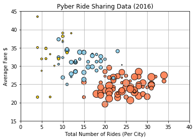
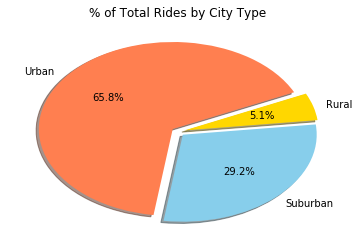
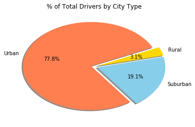
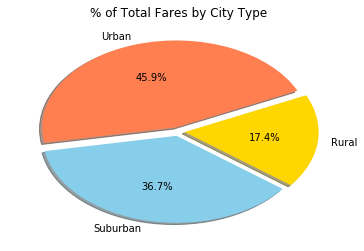

```python
import matplotlib.pyplot as plt
import pandas as pd
import numpy as np
```


```python
city_data = pd.read_csv('Resources/city_data.csv')
ride_data = pd.read_csv('Resources/ride_data.csv')
```


```python
merged_data = pd.merge( ride_data, city_data, on='city')
```


```python
city_data_df = city_data.set_index(['city'])
```


```python
average_fare = merged_data.groupby('city')['fare'].mean()
total_rides = merged_data.city.value_counts()
total_drivers = city_data.set_index('city').driver_count
city_type = city_data.set_index('city').type
pyber_df = pd.concat((city_data_df, average_fare),axis=1 , join='inner')
pyber_df = pd.concat((pyber_df, total_rides),axis=1, join='inner')
pyber_df.columns = ['driver_count','city_type','average_fare', 'total_rides']
pyber_df.head()
```


<div>
<style>
    .dataframe thead tr:only-child th {
        text-align: right;
    }

    .dataframe thead th {
        text-align: left;
    }

    .dataframe tbody tr th {
        vertical-align: top;
    }
</style>
<table border="1" class="dataframe">
  <thead>
    <tr style="text-align: right;">
      <th></th>
      <th>driver_count</th>
      <th>city_type</th>
      <th>average_fare</th>
      <th>total_rides</th>
    </tr>
  </thead>
  <tbody>
    <tr>
      <th>Kelseyland</th>
      <td>63</td>
      <td>Urban</td>
      <td>21.806429</td>
      <td>28</td>
    </tr>
    <tr>
      <th>Nguyenbury</th>
      <td>8</td>
      <td>Urban</td>
      <td>25.899615</td>
      <td>26</td>
    </tr>
    <tr>
      <th>East Douglas</th>
      <td>12</td>
      <td>Urban</td>
      <td>26.169091</td>
      <td>22</td>
    </tr>
    <tr>
      <th>West Dawnfurt</th>
      <td>34</td>
      <td>Urban</td>
      <td>22.330345</td>
      <td>29</td>
    </tr>
    <tr>
      <th>Rodriguezburgh</th>
      <td>52</td>
      <td>Urban</td>
      <td>21.332609</td>
      <td>23</td>
    </tr>
  </tbody>
</table>
</div>


```python
urban_plot = pyber_df[pyber_df['city_type']=='Urban']
suburban_plot =pyber_df[pyber_df['city_type']=='Suburban']
rural_plot = pyber_df[pyber_df['city_type']=='Rural']

```


```python
plt.scatter( x = urban_plot.total_rides , y = urban_plot.average_fare, s=urban_plot.driver_count*3, c = 'coral',alpha=.9,linewidth = 1,edgecolor = 'black')
plt.scatter( x = suburban_plot.total_rides , y = suburban_plot.average_fare, s=suburban_plot.driver_count*3, c = 'skyblue',alpha=.9,linewidth = 1,edgecolor = 'black')
plt.scatter( x = rural_plot.total_rides , y = rural_plot.average_fare, s=rural_plot.driver_count*3, c = 'gold',alpha =.9,linewidth = 1,edgecolor = 'black')
plt.title("Pyber Ride Sharing Data (2016)")
plt.ylabel("Average Fare $")
plt.xlabel("Total Number of Rides (Per City)")

plt.xlim([0, 40])
plt.ylim([15, 45])
plt.grid(True)
plt.show()
```





```python
urb = urban_plot.total_rides.sum()
sub = suburban_plot.total_rides.sum()
rur = rural_plot.total_rides.sum()
city_types = ['Urban' , 'Suburban', 'Rural']
totals = [urb,sub, rur]
colors = ['coral', 'skyblue', 'gold']
explode = [.05,.05,.05]
plt.pie(totals,explode=explode, labels = city_types, colors = colors,shadow = True, startangle=25, autopct ='%1.1f%%')
plt.title('% of Total Rides by City Type')
plt.show()
```





```python
urb = urban_plot.driver_count.sum()
sub = suburban_plot.driver_count.sum()
rur = rural_plot.driver_count.sum()
city_types = ['Urban' , 'Suburban', 'Rural']
totals = [urb,sub, rur]
colors = ['coral', 'skyblue', 'gold']
explode = [.05,.05,.05]
plt.pie(totals,explode=explode, labels = city_types, colors = colors,shadow = True, startangle=25, autopct ='%1.1f%%')
plt.title('% of Total Drivers by City Type')
plt.show()
```





```python
urb = urban_plot.average_fare.sum()
sub = suburban_plot.average_fare.sum()
rur = rural_plot.average_fare.sum()
city_types = ['Urban' , 'Suburban', 'Rural']
totals = [urb,sub, rur]
colors = ['coral', 'skyblue', 'gold']
explode = [.05,.05,.05]
plt.pie(totals,explode=explode, labels = city_types, colors = colors,shadow = True, startangle=25, autopct ='%1.1f%%')
plt.title('% of Total Fares by City Type')
plt.show()
```




