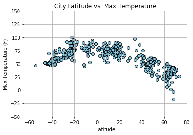
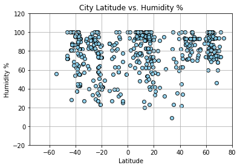
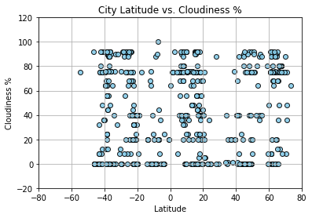
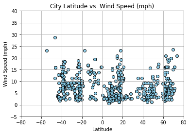

```python
from citipy import citipy
import csv as csv
import pandas as pd
import numpy as np
import matplotlib.pyplot as plt
import requests as req
```


```python
api_key = 'f215a06c68a032e58eaca437de60be88'
cities = pd.read_csv('worldcities.csv')
url = 'http://api.openweathermap.org/data/2.5/weather?'
units = 'imperial'
cities.head()
```


<div>
<style>
    .dataframe thead tr:only-child th {
        text-align: right;
    }

    .dataframe thead th {
        text-align: left;
    }

    .dataframe tbody tr th {
        vertical-align: top;
    }
</style>
<table border="1" class="dataframe">
  <thead>
    <tr style="text-align: right;">
      <th></th>
      <th>Country</th>
      <th>City</th>
      <th>Latitude</th>
      <th>Longitude</th>
    </tr>
  </thead>
  <tbody>
    <tr>
      <th>0</th>
      <td>ad</td>
      <td>andorra la vella</td>
      <td>42.500000</td>
      <td>1.516667</td>
    </tr>
    <tr>
      <th>1</th>
      <td>ad</td>
      <td>canillo</td>
      <td>42.566667</td>
      <td>1.600000</td>
    </tr>
    <tr>
      <th>2</th>
      <td>ad</td>
      <td>encamp</td>
      <td>42.533333</td>
      <td>1.583333</td>
    </tr>
    <tr>
      <th>3</th>
      <td>ad</td>
      <td>la massana</td>
      <td>42.550000</td>
      <td>1.516667</td>
    </tr>
    <tr>
      <th>4</th>
      <td>ad</td>
      <td>les escaldes</td>
      <td>42.500000</td>
      <td>1.533333</td>
    </tr>
  </tbody>
</table>
</div>


```python
first = cities[(cities['Latitude'].astype(int) > 60)]
second = cities[(cities['Latitude'].astype(int) <= 60) & (cities['Latitude'].astype(int) > 20)]
third = cities[(cities['Latitude'].astype(int) > -20) & (cities['Latitude'].astype(int) <= 20)]
fourth = cities[(cities['Latitude'].astype(int) <= -20) & (cities['Latitude'].astype(int)  >= -35)]
fifth = cities[(cities['Latitude'].astype(int) <-35)]                                               
first_sample = first.sample(83)
second_sample = second.sample(83)
third_sample = third.sample(166)
fourth_sample = fourth.sample(84)
fifth_sample = fifth.sample(83)
samples = [first_sample, second_sample, third_sample, fourth_sample, fifth_sample]
sample = pd.concat(samples)
sample.head()
```


<div>
<style>
    .dataframe thead tr:only-child th {
        text-align: right;
    }

    .dataframe thead th {
        text-align: left;
    }

    .dataframe tbody tr th {
        vertical-align: top;
    }
</style>
<table border="1" class="dataframe">
  <thead>
    <tr style="text-align: right;">
      <th></th>
      <th>Country</th>
      <th>City</th>
      <th>Latitude</th>
      <th>Longitude</th>
    </tr>
  </thead>
  <tbody>
    <tr>
      <th>25851</th>
      <td>no</td>
      <td>groa</td>
      <td>62.650000</td>
      <td>8.716667</td>
    </tr>
    <tr>
      <th>35657</th>
      <td>ru</td>
      <td>chupa</td>
      <td>66.270013</td>
      <td>33.054858</td>
    </tr>
    <tr>
      <th>38679</th>
      <td>ru</td>
      <td>udachnyy</td>
      <td>66.416667</td>
      <td>112.400000</td>
    </tr>
    <tr>
      <th>26135</th>
      <td>no</td>
      <td>verdalsora</td>
      <td>63.800000</td>
      <td>11.483333</td>
    </tr>
    <tr>
      <th>25914</th>
      <td>no</td>
      <td>kolvereid</td>
      <td>64.850000</td>
      <td>11.600000</td>
    </tr>
  </tbody>
</table>
</div>


```python
sample['Max Temp (f)'] = ''
sample['Humidity'] =''
sample['Cloudiness']=''
sample['Wind Speed(MPH)']=''
for index,row in sample.iterrows():
    query_url = url + 'appid=' + api_key + "&units=" + units + '&lat=' + str(row['Latitude']) + '&lon=' + str(row['Longitude'])
    city_info = req.get(query_url).json()
    city_temp = city_info['main']['temp_max']
    city_humid = city_info['main']['humidity']
    city_cloud = city_info['clouds']['all']
    city_wind_spd = city_info['wind']['speed']
    sample.set_value(index, 'Max Temp (f)',city_temp)
    sample.set_value(index, 'Humidity',city_humid)
    sample.set_value(index, 'Cloudiness',city_cloud)
    sample.set_value(index, 'Wind Speed(MPH)',city_wind_spd)
    print(query_url)
```

    http://api.openweathermap.org/data/2.5/weather?appid=f215a06c68a032e58eaca437de60be88&units=imperial&lat=62.65&lon=8.716667
    http://api.openweathermap.org/data/2.5/weather?appid=f215a06c68a032e58eaca437de60be88&units=imperial&lat=66.270013&lon=33.054858
    http://api.openweathermap.org/data/2.5/weather?appid=f215a06c68a032e58eaca437de60be88&units=imperial&lat=66.416667&lon=112.4
    http://api.openweathermap.org/data/2.5/weather?appid=f215a06c68a032e58eaca437de60be88&units=imperial&lat=63.8&lon=11.483333
    http://api.openweathermap.org/data/2.5/weather?appid=f215a06c68a032e58eaca437de60be88&units=imperial&lat=64.85&lon=11.6
    http://api.openweathermap.org/data/2.5/weather?appid=f215a06c68a032e58eaca437de60be88&units=imperial&lat=67.583333&lon=63.916667000000004
    http://api.openweathermap.org/data/2.5/weather?appid=f215a06c68a032e58eaca437de60be88&units=imperial&lat=61.884848999999996&lon=50.748925
    http://api.openweathermap.org/data/2.5/weather?appid=f215a06c68a032e58eaca437de60be88&units=imperial&lat=62.9&lon=27.683333
    http://api.openweathermap.org/data/2.5/weather?appid=f215a06c68a032e58eaca437de60be88&units=imperial&lat=61.316667&lon=7.8
    http://api.openweathermap.org/data/2.5/weather?appid=f215a06c68a032e58eaca437de60be88&units=imperial&lat=62.535278000000005&lon=113.96111100000002
    http://api.openweathermap.org/data/2.5/weather?appid=f215a06c68a032e58eaca437de60be88&units=imperial&lat=70.93333299999999&lon=27.35
    http://api.openweathermap.org/data/2.5/weather?appid=f215a06c68a032e58eaca437de60be88&units=imperial&lat=61.1&lon=28.5
    http://api.openweathermap.org/data/2.5/weather?appid=f215a06c68a032e58eaca437de60be88&units=imperial&lat=61.519813&lon=30.199173
    http://api.openweathermap.org/data/2.5/weather?appid=f215a06c68a032e58eaca437de60be88&units=imperial&lat=65.666667&lon=-20.3
    http://api.openweathermap.org/data/2.5/weather?appid=f215a06c68a032e58eaca437de60be88&units=imperial&lat=63.012778000000004&lon=112.47138899999999
    http://api.openweathermap.org/data/2.5/weather?appid=f215a06c68a032e58eaca437de60be88&units=imperial&lat=61.733332999999995&lon=17.1125
    http://api.openweathermap.org/data/2.5/weather?appid=f215a06c68a032e58eaca437de60be88&units=imperial&lat=66.083333&lon=13.833332999999998
    http://api.openweathermap.org/data/2.5/weather?appid=f215a06c68a032e58eaca437de60be88&units=imperial&lat=65.027045&lon=35.706812
    http://api.openweathermap.org/data/2.5/weather?appid=f215a06c68a032e58eaca437de60be88&units=imperial&lat=64.5011111&lon=-165.4063889
    http://api.openweathermap.org/data/2.5/weather?appid=f215a06c68a032e58eaca437de60be88&units=imperial&lat=64.766667&lon=26.1
    http://api.openweathermap.org/data/2.5/weather?appid=f215a06c68a032e58eaca437de60be88&units=imperial&lat=65.966667&lon=78.366667
    http://api.openweathermap.org/data/2.5/weather?appid=f215a06c68a032e58eaca437de60be88&units=imperial&lat=63.683333&lon=9.683333
    http://api.openweathermap.org/data/2.5/weather?appid=f215a06c68a032e58eaca437de60be88&units=imperial&lat=61.247016&lon=46.898418
    http://api.openweathermap.org/data/2.5/weather?appid=f215a06c68a032e58eaca437de60be88&units=imperial&lat=61.916667000000004&lon=34.25
    http://api.openweathermap.org/data/2.5/weather?appid=f215a06c68a032e58eaca437de60be88&units=imperial&lat=63.466667&lon=11.116667
    http://api.openweathermap.org/data/2.5/weather?appid=f215a06c68a032e58eaca437de60be88&units=imperial&lat=65.083333&lon=12.416667
    http://api.openweathermap.org/data/2.5/weather?appid=f215a06c68a032e58eaca437de60be88&units=imperial&lat=61.045486&lon=28.929376
    http://api.openweathermap.org/data/2.5/weather?appid=f215a06c68a032e58eaca437de60be88&units=imperial&lat=61.809881999999995&lon=36.534541
    http://api.openweathermap.org/data/2.5/weather?appid=f215a06c68a032e58eaca437de60be88&units=imperial&lat=62.266667000000005&lon=151.7
    http://api.openweathermap.org/data/2.5/weather?appid=f215a06c68a032e58eaca437de60be88&units=imperial&lat=62.216667&lon=5.6
    http://api.openweathermap.org/data/2.5/weather?appid=f215a06c68a032e58eaca437de60be88&units=imperial&lat=68.125833&lon=13.805278
    http://api.openweathermap.org/data/2.5/weather?appid=f215a06c68a032e58eaca437de60be88&units=imperial&lat=62.0&lon=-49.75
    http://api.openweathermap.org/data/2.5/weather?appid=f215a06c68a032e58eaca437de60be88&units=imperial&lat=67.633333&lon=134.633333
    http://api.openweathermap.org/data/2.5/weather?appid=f215a06c68a032e58eaca437de60be88&units=imperial&lat=69.233333&lon=19.233333
    http://api.openweathermap.org/data/2.5/weather?appid=f215a06c68a032e58eaca437de60be88&units=imperial&lat=67.033333&lon=14.033332999999999
    http://api.openweathermap.org/data/2.5/weather?appid=f215a06c68a032e58eaca437de60be88&units=imperial&lat=71.000556&lon=24.696111
    http://api.openweathermap.org/data/2.5/weather?appid=f215a06c68a032e58eaca437de60be88&units=imperial&lat=68.701944&lon=15.423889
    http://api.openweathermap.org/data/2.5/weather?appid=f215a06c68a032e58eaca437de60be88&units=imperial&lat=61.075993999999994&lon=46.502381
    http://api.openweathermap.org/data/2.5/weather?appid=f215a06c68a032e58eaca437de60be88&units=imperial&lat=64.883333&lon=-23.716667
    http://api.openweathermap.org/data/2.5/weather?appid=f215a06c68a032e58eaca437de60be88&units=imperial&lat=68.783333&lon=16.183332999999998
    http://api.openweathermap.org/data/2.5/weather?appid=f215a06c68a032e58eaca437de60be88&units=imperial&lat=64.5401&lon=40.5433
    http://api.openweathermap.org/data/2.5/weather?appid=f215a06c68a032e58eaca437de60be88&units=imperial&lat=61.683333&lon=27.25
    http://api.openweathermap.org/data/2.5/weather?appid=f215a06c68a032e58eaca437de60be88&units=imperial&lat=61.507071999999994&lon=38.945636
    http://api.openweathermap.org/data/2.5/weather?appid=f215a06c68a032e58eaca437de60be88&units=imperial&lat=62.668333&lon=131.16833300000002
    http://api.openweathermap.org/data/2.5/weather?appid=f215a06c68a032e58eaca437de60be88&units=imperial&lat=62.95&lon=23.0
    http://api.openweathermap.org/data/2.5/weather?appid=f215a06c68a032e58eaca437de60be88&units=imperial&lat=67.5&lon=64.0
    http://api.openweathermap.org/data/2.5/weather?appid=f215a06c68a032e58eaca437de60be88&units=imperial&lat=61.333332999999996&lon=22.9
    http://api.openweathermap.org/data/2.5/weather?appid=f215a06c68a032e58eaca437de60be88&units=imperial&lat=62.233332999999995&lon=25.733333
    http://api.openweathermap.org/data/2.5/weather?appid=f215a06c68a032e58eaca437de60be88&units=imperial&lat=64.4&lon=11.4
    http://api.openweathermap.org/data/2.5/weather?appid=f215a06c68a032e58eaca437de60be88&units=imperial&lat=62.45&lon=-114.35
    http://api.openweathermap.org/data/2.5/weather?appid=f215a06c68a032e58eaca437de60be88&units=imperial&lat=61.361389&lon=63.584167
    http://api.openweathermap.org/data/2.5/weather?appid=f215a06c68a032e58eaca437de60be88&units=imperial&lat=63.183333&lon=14.65
    http://api.openweathermap.org/data/2.5/weather?appid=f215a06c68a032e58eaca437de60be88&units=imperial&lat=70.983333&lon=25.983333
    http://api.openweathermap.org/data/2.5/weather?appid=f215a06c68a032e58eaca437de60be88&units=imperial&lat=62.514722&lon=65.887778
    http://api.openweathermap.org/data/2.5/weather?appid=f215a06c68a032e58eaca437de60be88&units=imperial&lat=63.602288&lon=53.881751
    http://api.openweathermap.org/data/2.5/weather?appid=f215a06c68a032e58eaca437de60be88&units=imperial&lat=66.4&lon=14.516667000000002
    http://api.openweathermap.org/data/2.5/weather?appid=f215a06c68a032e58eaca437de60be88&units=imperial&lat=73.50694399999999&lon=80.546389
    http://api.openweathermap.org/data/2.5/weather?appid=f215a06c68a032e58eaca437de60be88&units=imperial&lat=61.55&lon=-6.8
    http://api.openweathermap.org/data/2.5/weather?appid=f215a06c68a032e58eaca437de60be88&units=imperial&lat=66.083333&lon=60.13333299999999
    http://api.openweathermap.org/data/2.5/weather?appid=f215a06c68a032e58eaca437de60be88&units=imperial&lat=69.04303&lon=33.199061
    http://api.openweathermap.org/data/2.5/weather?appid=f215a06c68a032e58eaca437de60be88&units=imperial&lat=67.162002&lon=32.412287
    http://api.openweathermap.org/data/2.5/weather?appid=f215a06c68a032e58eaca437de60be88&units=imperial&lat=61.0296&lon=76.1136
    http://api.openweathermap.org/data/2.5/weather?appid=f215a06c68a032e58eaca437de60be88&units=imperial&lat=62.816667&lon=7.6666669999999995
    http://api.openweathermap.org/data/2.5/weather?appid=f215a06c68a032e58eaca437de60be88&units=imperial&lat=65.75&lon=150.85
    http://api.openweathermap.org/data/2.5/weather?appid=f215a06c68a032e58eaca437de60be88&units=imperial&lat=61.468056000000004&lon=128.920278
    http://api.openweathermap.org/data/2.5/weather?appid=f215a06c68a032e58eaca437de60be88&units=imperial&lat=61.559777000000004&lon=45.933956
    http://api.openweathermap.org/data/2.5/weather?appid=f215a06c68a032e58eaca437de60be88&units=imperial&lat=64.4165&lon=40.8122
    http://api.openweathermap.org/data/2.5/weather?appid=f215a06c68a032e58eaca437de60be88&units=imperial&lat=63.916667000000004&lon=24.966667
    http://api.openweathermap.org/data/2.5/weather?appid=f215a06c68a032e58eaca437de60be88&units=imperial&lat=70.4833333&lon=-21.966666699999998
    http://api.openweathermap.org/data/2.5/weather?appid=f215a06c68a032e58eaca437de60be88&units=imperial&lat=66.083333&lon=60.516667000000005
    http://api.openweathermap.org/data/2.5/weather?appid=f215a06c68a032e58eaca437de60be88&units=imperial&lat=63.65&lon=22.683332999999998
    http://api.openweathermap.org/data/2.5/weather?appid=f215a06c68a032e58eaca437de60be88&units=imperial&lat=62.483332999999995&lon=6.8
    http://api.openweathermap.org/data/2.5/weather?appid=f215a06c68a032e58eaca437de60be88&units=imperial&lat=63.566667&lon=27.183333
    http://api.openweathermap.org/data/2.5/weather?appid=f215a06c68a032e58eaca437de60be88&units=imperial&lat=65.6&lon=-37.6333333
    http://api.openweathermap.org/data/2.5/weather?appid=f215a06c68a032e58eaca437de60be88&units=imperial&lat=65.147165&lon=57.224392
    http://api.openweathermap.org/data/2.5/weather?appid=f215a06c68a032e58eaca437de60be88&units=imperial&lat=69.7576&lon=61.6655
    http://api.openweathermap.org/data/2.5/weather?appid=f215a06c68a032e58eaca437de60be88&units=imperial&lat=68.979174&lon=33.092514
    http://api.openweathermap.org/data/2.5/weather?appid=f215a06c68a032e58eaca437de60be88&units=imperial&lat=69.667222&lon=29.984721999999998
    http://api.openweathermap.org/data/2.5/weather?appid=f215a06c68a032e58eaca437de60be88&units=imperial&lat=61.112134&lon=28.863211
    http://api.openweathermap.org/data/2.5/weather?appid=f215a06c68a032e58eaca437de60be88&units=imperial&lat=67.35&lon=15.6
    http://api.openweathermap.org/data/2.5/weather?appid=f215a06c68a032e58eaca437de60be88&units=imperial&lat=68.05&lon=166.333333
    http://api.openweathermap.org/data/2.5/weather?appid=f215a06c68a032e58eaca437de60be88&units=imperial&lat=63.1&lon=21.6
    http://api.openweathermap.org/data/2.5/weather?appid=f215a06c68a032e58eaca437de60be88&units=imperial&lat=63.898610999999995&lon=122.76166699999999
    http://api.openweathermap.org/data/2.5/weather?appid=f215a06c68a032e58eaca437de60be88&units=imperial&lat=49.706317&lon=17.076908
    http://api.openweathermap.org/data/2.5/weather?appid=f215a06c68a032e58eaca437de60be88&units=imperial&lat=60.15&lon=11.183333
    http://api.openweathermap.org/data/2.5/weather?appid=f215a06c68a032e58eaca437de60be88&units=imperial&lat=44.415833299999996&lon=17.0861111
    http://api.openweathermap.org/data/2.5/weather?appid=f215a06c68a032e58eaca437de60be88&units=imperial&lat=48.0&lon=-66.666667
    http://api.openweathermap.org/data/2.5/weather?appid=f215a06c68a032e58eaca437de60be88&units=imperial&lat=41.9558333&lon=-87.8708333
    http://api.openweathermap.org/data/2.5/weather?appid=f215a06c68a032e58eaca437de60be88&units=imperial&lat=45.483333&lon=-72.31666700000001
    http://api.openweathermap.org/data/2.5/weather?appid=f215a06c68a032e58eaca437de60be88&units=imperial&lat=44.05&lon=24.3
    http://api.openweathermap.org/data/2.5/weather?appid=f215a06c68a032e58eaca437de60be88&units=imperial&lat=24.633333&lon=-101.416667
    http://api.openweathermap.org/data/2.5/weather?appid=f215a06c68a032e58eaca437de60be88&units=imperial&lat=43.866667&lon=24.45
    http://api.openweathermap.org/data/2.5/weather?appid=f215a06c68a032e58eaca437de60be88&units=imperial&lat=44.433333000000005&lon=24.366667
    http://api.openweathermap.org/data/2.5/weather?appid=f215a06c68a032e58eaca437de60be88&units=imperial&lat=23.2&lon=81.966667
    http://api.openweathermap.org/data/2.5/weather?appid=f215a06c68a032e58eaca437de60be88&units=imperial&lat=44.466667&lon=26.55
    http://api.openweathermap.org/data/2.5/weather?appid=f215a06c68a032e58eaca437de60be88&units=imperial&lat=41.659167&lon=123.33916699999999
    http://api.openweathermap.org/data/2.5/weather?appid=f215a06c68a032e58eaca437de60be88&units=imperial&lat=48.215249&lon=23.328665
    http://api.openweathermap.org/data/2.5/weather?appid=f215a06c68a032e58eaca437de60be88&units=imperial&lat=24.55&lon=92.6
    http://api.openweathermap.org/data/2.5/weather?appid=f215a06c68a032e58eaca437de60be88&units=imperial&lat=35.0525&lon=-97.93611109999999
    http://api.openweathermap.org/data/2.5/weather?appid=f215a06c68a032e58eaca437de60be88&units=imperial&lat=49.454685&lon=1.122298
    http://api.openweathermap.org/data/2.5/weather?appid=f215a06c68a032e58eaca437de60be88&units=imperial&lat=47.782571000000004&lon=19.928003
    http://api.openweathermap.org/data/2.5/weather?appid=f215a06c68a032e58eaca437de60be88&units=imperial&lat=54.3&lon=9.666667
    http://api.openweathermap.org/data/2.5/weather?appid=f215a06c68a032e58eaca437de60be88&units=imperial&lat=39.267231&lon=-9.157952
    http://api.openweathermap.org/data/2.5/weather?appid=f215a06c68a032e58eaca437de60be88&units=imperial&lat=27.717221999999996&lon=109.185278
    http://api.openweathermap.org/data/2.5/weather?appid=f215a06c68a032e58eaca437de60be88&units=imperial&lat=22.833333&lon=72.766667
    http://api.openweathermap.org/data/2.5/weather?appid=f215a06c68a032e58eaca437de60be88&units=imperial&lat=60.153228000000006&lon=30.516463
    http://api.openweathermap.org/data/2.5/weather?appid=f215a06c68a032e58eaca437de60be88&units=imperial&lat=52.416667&lon=9.6
    http://api.openweathermap.org/data/2.5/weather?appid=f215a06c68a032e58eaca437de60be88&units=imperial&lat=45.9&lon=28.668889
    http://api.openweathermap.org/data/2.5/weather?appid=f215a06c68a032e58eaca437de60be88&units=imperial&lat=40.666667&lon=14.733332999999998
    http://api.openweathermap.org/data/2.5/weather?appid=f215a06c68a032e58eaca437de60be88&units=imperial&lat=48.812532&lon=2.048632
    http://api.openweathermap.org/data/2.5/weather?appid=f215a06c68a032e58eaca437de60be88&units=imperial&lat=43.35&lon=24.1333333
    http://api.openweathermap.org/data/2.5/weather?appid=f215a06c68a032e58eaca437de60be88&units=imperial&lat=54.1833333&lon=-7.2333333
    http://api.openweathermap.org/data/2.5/weather?appid=f215a06c68a032e58eaca437de60be88&units=imperial&lat=48.11988&lon=25.774214
    http://api.openweathermap.org/data/2.5/weather?appid=f215a06c68a032e58eaca437de60be88&units=imperial&lat=29.116667&lon=75.166667
    http://api.openweathermap.org/data/2.5/weather?appid=f215a06c68a032e58eaca437de60be88&units=imperial&lat=43.753056&lon=20.095556
    http://api.openweathermap.org/data/2.5/weather?appid=f215a06c68a032e58eaca437de60be88&units=imperial&lat=40.506667&lon=46.825
    http://api.openweathermap.org/data/2.5/weather?appid=f215a06c68a032e58eaca437de60be88&units=imperial&lat=35.2666667&lon=25.1333333
    http://api.openweathermap.org/data/2.5/weather?appid=f215a06c68a032e58eaca437de60be88&units=imperial&lat=49.166396999999996&lon=6.943363000000001
    http://api.openweathermap.org/data/2.5/weather?appid=f215a06c68a032e58eaca437de60be88&units=imperial&lat=46.340505&lon=19.051153
    http://api.openweathermap.org/data/2.5/weather?appid=f215a06c68a032e58eaca437de60be88&units=imperial&lat=34.001389&lon=131.183611
    http://api.openweathermap.org/data/2.5/weather?appid=f215a06c68a032e58eaca437de60be88&units=imperial&lat=53.4751&lon=40.2095
    http://api.openweathermap.org/data/2.5/weather?appid=f215a06c68a032e58eaca437de60be88&units=imperial&lat=54.8833333&lon=23.6166667
    http://api.openweathermap.org/data/2.5/weather?appid=f215a06c68a032e58eaca437de60be88&units=imperial&lat=49.484367&lon=43.861255
    http://api.openweathermap.org/data/2.5/weather?appid=f215a06c68a032e58eaca437de60be88&units=imperial&lat=48.859171&lon=27.796901000000002
    http://api.openweathermap.org/data/2.5/weather?appid=f215a06c68a032e58eaca437de60be88&units=imperial&lat=34.7&lon=137.85
    http://api.openweathermap.org/data/2.5/weather?appid=f215a06c68a032e58eaca437de60be88&units=imperial&lat=52.965076&lon=36.078495000000004
    http://api.openweathermap.org/data/2.5/weather?appid=f215a06c68a032e58eaca437de60be88&units=imperial&lat=36.809166999999995&lon=10.140556
    http://api.openweathermap.org/data/2.5/weather?appid=f215a06c68a032e58eaca437de60be88&units=imperial&lat=47.733654&lon=17.828836
    http://api.openweathermap.org/data/2.5/weather?appid=f215a06c68a032e58eaca437de60be88&units=imperial&lat=48.321494&lon=22.191066
    http://api.openweathermap.org/data/2.5/weather?appid=f215a06c68a032e58eaca437de60be88&units=imperial&lat=39.041667&lon=29.41
    http://api.openweathermap.org/data/2.5/weather?appid=f215a06c68a032e58eaca437de60be88&units=imperial&lat=37.978055600000005&lon=-122.03
    http://api.openweathermap.org/data/2.5/weather?appid=f215a06c68a032e58eaca437de60be88&units=imperial&lat=50.878539&lon=15.181515
    http://api.openweathermap.org/data/2.5/weather?appid=f215a06c68a032e58eaca437de60be88&units=imperial&lat=55.472102&lon=39.080172999999995
    http://api.openweathermap.org/data/2.5/weather?appid=f215a06c68a032e58eaca437de60be88&units=imperial&lat=49.658333299999995&lon=6.1372222
    http://api.openweathermap.org/data/2.5/weather?appid=f215a06c68a032e58eaca437de60be88&units=imperial&lat=33.6802778&lon=-116.17305559999998
    http://api.openweathermap.org/data/2.5/weather?appid=f215a06c68a032e58eaca437de60be88&units=imperial&lat=45.6&lon=8.633333
    http://api.openweathermap.org/data/2.5/weather?appid=f215a06c68a032e58eaca437de60be88&units=imperial&lat=58.862706&lon=60.805363
    http://api.openweathermap.org/data/2.5/weather?appid=f215a06c68a032e58eaca437de60be88&units=imperial&lat=40.898888899999996&lon=-74.0930556
    http://api.openweathermap.org/data/2.5/weather?appid=f215a06c68a032e58eaca437de60be88&units=imperial&lat=59.65&lon=11.0
    http://api.openweathermap.org/data/2.5/weather?appid=f215a06c68a032e58eaca437de60be88&units=imperial&lat=40.925&lon=-98.3416667
    http://api.openweathermap.org/data/2.5/weather?appid=f215a06c68a032e58eaca437de60be88&units=imperial&lat=59.46204300000001&lon=29.629934000000002
    http://api.openweathermap.org/data/2.5/weather?appid=f215a06c68a032e58eaca437de60be88&units=imperial&lat=49.45&lon=-120.5
    http://api.openweathermap.org/data/2.5/weather?appid=f215a06c68a032e58eaca437de60be88&units=imperial&lat=50.65&lon=3.916667
    http://api.openweathermap.org/data/2.5/weather?appid=f215a06c68a032e58eaca437de60be88&units=imperial&lat=55.45&lon=-4.366667
    http://api.openweathermap.org/data/2.5/weather?appid=f215a06c68a032e58eaca437de60be88&units=imperial&lat=46.566666999999995&lon=-71.43333299999999
    http://api.openweathermap.org/data/2.5/weather?appid=f215a06c68a032e58eaca437de60be88&units=imperial&lat=44.456111&lon=20.073889
    http://api.openweathermap.org/data/2.5/weather?appid=f215a06c68a032e58eaca437de60be88&units=imperial&lat=44.4258&lon=39.5362
    http://api.openweathermap.org/data/2.5/weather?appid=f215a06c68a032e58eaca437de60be88&units=imperial&lat=28.098519&lon=-16.682201
    http://api.openweathermap.org/data/2.5/weather?appid=f215a06c68a032e58eaca437de60be88&units=imperial&lat=37.15964&lon=9.760601
    http://api.openweathermap.org/data/2.5/weather?appid=f215a06c68a032e58eaca437de60be88&units=imperial&lat=45.402996&lon=28.675461
    http://api.openweathermap.org/data/2.5/weather?appid=f215a06c68a032e58eaca437de60be88&units=imperial&lat=51.166667&lon=2.95
    http://api.openweathermap.org/data/2.5/weather?appid=f215a06c68a032e58eaca437de60be88&units=imperial&lat=23.666667&lon=85.283333
    http://api.openweathermap.org/data/2.5/weather?appid=f215a06c68a032e58eaca437de60be88&units=imperial&lat=47.258381&lon=39.866746
    http://api.openweathermap.org/data/2.5/weather?appid=f215a06c68a032e58eaca437de60be88&units=imperial&lat=48.917194&lon=31.716706
    http://api.openweathermap.org/data/2.5/weather?appid=f215a06c68a032e58eaca437de60be88&units=imperial&lat=50.968414&lon=5.767249
    http://api.openweathermap.org/data/2.5/weather?appid=f215a06c68a032e58eaca437de60be88&units=imperial&lat=45.1665&lon=41.0039
    http://api.openweathermap.org/data/2.5/weather?appid=f215a06c68a032e58eaca437de60be88&units=imperial&lat=44.0975&lon=17.8788889
    http://api.openweathermap.org/data/2.5/weather?appid=f215a06c68a032e58eaca437de60be88&units=imperial&lat=45.016667&lon=27.7
    http://api.openweathermap.org/data/2.5/weather?appid=f215a06c68a032e58eaca437de60be88&units=imperial&lat=42.1538889&lon=42.335
    http://api.openweathermap.org/data/2.5/weather?appid=f215a06c68a032e58eaca437de60be88&units=imperial&lat=41.913584&lon=0.194091
    http://api.openweathermap.org/data/2.5/weather?appid=f215a06c68a032e58eaca437de60be88&units=imperial&lat=41.05&lon=23.6833333
    http://api.openweathermap.org/data/2.5/weather?appid=f215a06c68a032e58eaca437de60be88&units=imperial&lat=47.916667&lon=9.25
    http://api.openweathermap.org/data/2.5/weather?appid=f215a06c68a032e58eaca437de60be88&units=imperial&lat=49.483333&lon=-117.28333300000001
    http://api.openweathermap.org/data/2.5/weather?appid=f215a06c68a032e58eaca437de60be88&units=imperial&lat=21.033333&lon=-104.366667
    http://api.openweathermap.org/data/2.5/weather?appid=f215a06c68a032e58eaca437de60be88&units=imperial&lat=39.2463889&lon=-84.58361109999998
    http://api.openweathermap.org/data/2.5/weather?appid=f215a06c68a032e58eaca437de60be88&units=imperial&lat=54.187142&lon=32.158165999999994
    http://api.openweathermap.org/data/2.5/weather?appid=f215a06c68a032e58eaca437de60be88&units=imperial&lat=9.683333&lon=123.15
    http://api.openweathermap.org/data/2.5/weather?appid=f215a06c68a032e58eaca437de60be88&units=imperial&lat=5.296591&lon=-75.054962
    http://api.openweathermap.org/data/2.5/weather?appid=f215a06c68a032e58eaca437de60be88&units=imperial&lat=-7.25&lon=-39.133333
    http://api.openweathermap.org/data/2.5/weather?appid=f215a06c68a032e58eaca437de60be88&units=imperial&lat=13.016666699999998&lon=31.866666700000003
    http://api.openweathermap.org/data/2.5/weather?appid=f215a06c68a032e58eaca437de60be88&units=imperial&lat=6.719726&lon=126.09998200000001
    http://api.openweathermap.org/data/2.5/weather?appid=f215a06c68a032e58eaca437de60be88&units=imperial&lat=17.489695&lon=104.10055600000001
    http://api.openweathermap.org/data/2.5/weather?appid=f215a06c68a032e58eaca437de60be88&units=imperial&lat=15.3&lon=-61.4
    http://api.openweathermap.org/data/2.5/weather?appid=f215a06c68a032e58eaca437de60be88&units=imperial&lat=9.7937&lon=122.4543
    http://api.openweathermap.org/data/2.5/weather?appid=f215a06c68a032e58eaca437de60be88&units=imperial&lat=1.8399439999999998&lon=-76.968889
    http://api.openweathermap.org/data/2.5/weather?appid=f215a06c68a032e58eaca437de60be88&units=imperial&lat=-7.85&lon=-37.983333
    http://api.openweathermap.org/data/2.5/weather?appid=f215a06c68a032e58eaca437de60be88&units=imperial&lat=-11.5333333&lon=-75.9
    http://api.openweathermap.org/data/2.5/weather?appid=f215a06c68a032e58eaca437de60be88&units=imperial&lat=-6.15&lon=143.65
    http://api.openweathermap.org/data/2.5/weather?appid=f215a06c68a032e58eaca437de60be88&units=imperial&lat=-18.95&lon=-46.983333
    http://api.openweathermap.org/data/2.5/weather?appid=f215a06c68a032e58eaca437de60be88&units=imperial&lat=1.2472219999999998&lon=111.45277800000001
    http://api.openweathermap.org/data/2.5/weather?appid=f215a06c68a032e58eaca437de60be88&units=imperial&lat=15.858510999999998&lon=104.628834
    http://api.openweathermap.org/data/2.5/weather?appid=f215a06c68a032e58eaca437de60be88&units=imperial&lat=17.933332999999998&lon=-94.675
    http://api.openweathermap.org/data/2.5/weather?appid=f215a06c68a032e58eaca437de60be88&units=imperial&lat=9.7343&lon=124.5383
    http://api.openweathermap.org/data/2.5/weather?appid=f215a06c68a032e58eaca437de60be88&units=imperial&lat=10.48115&lon=-6.406939
    http://api.openweathermap.org/data/2.5/weather?appid=f215a06c68a032e58eaca437de60be88&units=imperial&lat=12.810516&lon=121.46741499999999
    http://api.openweathermap.org/data/2.5/weather?appid=f215a06c68a032e58eaca437de60be88&units=imperial&lat=6.462212999999999&lon=-75.556556
    http://api.openweathermap.org/data/2.5/weather?appid=f215a06c68a032e58eaca437de60be88&units=imperial&lat=-3.7&lon=-38.65
    http://api.openweathermap.org/data/2.5/weather?appid=f215a06c68a032e58eaca437de60be88&units=imperial&lat=20.583333&lon=-89.983333
    http://api.openweathermap.org/data/2.5/weather?appid=f215a06c68a032e58eaca437de60be88&units=imperial&lat=-12.25&lon=-41.6
    http://api.openweathermap.org/data/2.5/weather?appid=f215a06c68a032e58eaca437de60be88&units=imperial&lat=-10.583333&lon=-37.366667
    http://api.openweathermap.org/data/2.5/weather?appid=f215a06c68a032e58eaca437de60be88&units=imperial&lat=19.483333&lon=-98.35
    http://api.openweathermap.org/data/2.5/weather?appid=f215a06c68a032e58eaca437de60be88&units=imperial&lat=14.7833333&lon=-88.7
    http://api.openweathermap.org/data/2.5/weather?appid=f215a06c68a032e58eaca437de60be88&units=imperial&lat=14.45&lon=-11.433333300000001
    http://api.openweathermap.org/data/2.5/weather?appid=f215a06c68a032e58eaca437de60be88&units=imperial&lat=16.766667&lon=-97.983333
    http://api.openweathermap.org/data/2.5/weather?appid=f215a06c68a032e58eaca437de60be88&units=imperial&lat=8.341111&lon=124.25916699999999
    http://api.openweathermap.org/data/2.5/weather?appid=f215a06c68a032e58eaca437de60be88&units=imperial&lat=-5.45&lon=-39.716667
    http://api.openweathermap.org/data/2.5/weather?appid=f215a06c68a032e58eaca437de60be88&units=imperial&lat=-6.735&lon=110.8444
    http://api.openweathermap.org/data/2.5/weather?appid=f215a06c68a032e58eaca437de60be88&units=imperial&lat=16.4&lon=-92.383333
    http://api.openweathermap.org/data/2.5/weather?appid=f215a06c68a032e58eaca437de60be88&units=imperial&lat=17.15754&lon=121.61354399999999
    http://api.openweathermap.org/data/2.5/weather?appid=f215a06c68a032e58eaca437de60be88&units=imperial&lat=18.9&lon=-97.0
    http://api.openweathermap.org/data/2.5/weather?appid=f215a06c68a032e58eaca437de60be88&units=imperial&lat=8.054444&lon=125.28388899999999
    http://api.openweathermap.org/data/2.5/weather?appid=f215a06c68a032e58eaca437de60be88&units=imperial&lat=-0.9333333&lon=-80.2166667
    http://api.openweathermap.org/data/2.5/weather?appid=f215a06c68a032e58eaca437de60be88&units=imperial&lat=9.756667&lon=126.11027800000001
    http://api.openweathermap.org/data/2.5/weather?appid=f215a06c68a032e58eaca437de60be88&units=imperial&lat=20.666667&lon=-103.7
    http://api.openweathermap.org/data/2.5/weather?appid=f215a06c68a032e58eaca437de60be88&units=imperial&lat=-13.833333300000001&lon=-171.9666667
    http://api.openweathermap.org/data/2.5/weather?appid=f215a06c68a032e58eaca437de60be88&units=imperial&lat=-7.183333&lon=-35.766667
    http://api.openweathermap.org/data/2.5/weather?appid=f215a06c68a032e58eaca437de60be88&units=imperial&lat=19.276944&lon=-99.77555600000001
    http://api.openweathermap.org/data/2.5/weather?appid=f215a06c68a032e58eaca437de60be88&units=imperial&lat=14.266666699999998&lon=-87.0333333
    http://api.openweathermap.org/data/2.5/weather?appid=f215a06c68a032e58eaca437de60be88&units=imperial&lat=10.780944&lon=123.393803
    http://api.openweathermap.org/data/2.5/weather?appid=f215a06c68a032e58eaca437de60be88&units=imperial&lat=-11.9666667&lon=-75.25
    http://api.openweathermap.org/data/2.5/weather?appid=f215a06c68a032e58eaca437de60be88&units=imperial&lat=16.466666699999998&lon=-15.683333300000001
    http://api.openweathermap.org/data/2.5/weather?appid=f215a06c68a032e58eaca437de60be88&units=imperial&lat=18.0369444&lon=-66.85027779999999
    http://api.openweathermap.org/data/2.5/weather?appid=f215a06c68a032e58eaca437de60be88&units=imperial&lat=-8.983333300000002&lon=-78.6
    http://api.openweathermap.org/data/2.5/weather?appid=f215a06c68a032e58eaca437de60be88&units=imperial&lat=5.496047&lon=-76.549448
    http://api.openweathermap.org/data/2.5/weather?appid=f215a06c68a032e58eaca437de60be88&units=imperial&lat=6.066667&lon=121.066667
    http://api.openweathermap.org/data/2.5/weather?appid=f215a06c68a032e58eaca437de60be88&units=imperial&lat=14.783332999999999&lon=122.183333
    http://api.openweathermap.org/data/2.5/weather?appid=f215a06c68a032e58eaca437de60be88&units=imperial&lat=13.721442000000001&lon=101.208136
    http://api.openweathermap.org/data/2.5/weather?appid=f215a06c68a032e58eaca437de60be88&units=imperial&lat=-4.016667&lon=-42.083333
    http://api.openweathermap.org/data/2.5/weather?appid=f215a06c68a032e58eaca437de60be88&units=imperial&lat=-6.750278&lon=107.046667
    http://api.openweathermap.org/data/2.5/weather?appid=f215a06c68a032e58eaca437de60be88&units=imperial&lat=-8.8&lon=35.8166667
    http://api.openweathermap.org/data/2.5/weather?appid=f215a06c68a032e58eaca437de60be88&units=imperial&lat=17.6292&lon=121.6105
    http://api.openweathermap.org/data/2.5/weather?appid=f215a06c68a032e58eaca437de60be88&units=imperial&lat=-19.55&lon=-42.116667
    http://api.openweathermap.org/data/2.5/weather?appid=f215a06c68a032e58eaca437de60be88&units=imperial&lat=-3.85&lon=35.533333299999995
    http://api.openweathermap.org/data/2.5/weather?appid=f215a06c68a032e58eaca437de60be88&units=imperial&lat=10.116667&lon=78.116667
    http://api.openweathermap.org/data/2.5/weather?appid=f215a06c68a032e58eaca437de60be88&units=imperial&lat=8.666667&lon=38.216667
    http://api.openweathermap.org/data/2.5/weather?appid=f215a06c68a032e58eaca437de60be88&units=imperial&lat=10.3971&lon=122.8911
    http://api.openweathermap.org/data/2.5/weather?appid=f215a06c68a032e58eaca437de60be88&units=imperial&lat=15.2833333&lon=-86.9666667
    http://api.openweathermap.org/data/2.5/weather?appid=f215a06c68a032e58eaca437de60be88&units=imperial&lat=-17.55&lon=-63.216666700000005
    http://api.openweathermap.org/data/2.5/weather?appid=f215a06c68a032e58eaca437de60be88&units=imperial&lat=-6.85&lon=-35.483333
    http://api.openweathermap.org/data/2.5/weather?appid=f215a06c68a032e58eaca437de60be88&units=imperial&lat=7.866667&lon=-76.666667
    http://api.openweathermap.org/data/2.5/weather?appid=f215a06c68a032e58eaca437de60be88&units=imperial&lat=12.083333300000001&lon=-85.4
    http://api.openweathermap.org/data/2.5/weather?appid=f215a06c68a032e58eaca437de60be88&units=imperial&lat=18.4463889&lon=-66.3880556
    http://api.openweathermap.org/data/2.5/weather?appid=f215a06c68a032e58eaca437de60be88&units=imperial&lat=2.451994&lon=-76.810288
    http://api.openweathermap.org/data/2.5/weather?appid=f215a06c68a032e58eaca437de60be88&units=imperial&lat=16.1312&lon=120.5305
    http://api.openweathermap.org/data/2.5/weather?appid=f215a06c68a032e58eaca437de60be88&units=imperial&lat=20.416667&lon=106.16666699999999
    http://api.openweathermap.org/data/2.5/weather?appid=f215a06c68a032e58eaca437de60be88&units=imperial&lat=18.766667&lon=-98.55
    http://api.openweathermap.org/data/2.5/weather?appid=f215a06c68a032e58eaca437de60be88&units=imperial&lat=18.0&lon=79.583333
    http://api.openweathermap.org/data/2.5/weather?appid=f215a06c68a032e58eaca437de60be88&units=imperial&lat=18.3328&lon=120.6177
    http://api.openweathermap.org/data/2.5/weather?appid=f215a06c68a032e58eaca437de60be88&units=imperial&lat=16.5&lon=-95.466667
    http://api.openweathermap.org/data/2.5/weather?appid=f215a06c68a032e58eaca437de60be88&units=imperial&lat=5.874008&lon=-72.982166
    http://api.openweathermap.org/data/2.5/weather?appid=f215a06c68a032e58eaca437de60be88&units=imperial&lat=10.002991999999999&lon=-84.190393
    http://api.openweathermap.org/data/2.5/weather?appid=f215a06c68a032e58eaca437de60be88&units=imperial&lat=7.244074&lon=-76.435645
    http://api.openweathermap.org/data/2.5/weather?appid=f215a06c68a032e58eaca437de60be88&units=imperial&lat=15.383332999999999&lon=-91.716667
    http://api.openweathermap.org/data/2.5/weather?appid=f215a06c68a032e58eaca437de60be88&units=imperial&lat=13.1944&lon=123.3271
    http://api.openweathermap.org/data/2.5/weather?appid=f215a06c68a032e58eaca437de60be88&units=imperial&lat=-7.25&lon=-35.266667
    http://api.openweathermap.org/data/2.5/weather?appid=f215a06c68a032e58eaca437de60be88&units=imperial&lat=19.281944&lon=-99.73861099999999
    http://api.openweathermap.org/data/2.5/weather?appid=f215a06c68a032e58eaca437de60be88&units=imperial&lat=9.15&lon=39.033333
    http://api.openweathermap.org/data/2.5/weather?appid=f215a06c68a032e58eaca437de60be88&units=imperial&lat=7.25&lon=124.433333
    http://api.openweathermap.org/data/2.5/weather?appid=f215a06c68a032e58eaca437de60be88&units=imperial&lat=7.964444&lon=-74.05444399999999
    http://api.openweathermap.org/data/2.5/weather?appid=f215a06c68a032e58eaca437de60be88&units=imperial&lat=18.0666667&lon=-88.55
    http://api.openweathermap.org/data/2.5/weather?appid=f215a06c68a032e58eaca437de60be88&units=imperial&lat=17.466666699999998&lon=-62.9833333
    http://api.openweathermap.org/data/2.5/weather?appid=f215a06c68a032e58eaca437de60be88&units=imperial&lat=-13.816666699999999&lon=-171.7833333
    http://api.openweathermap.org/data/2.5/weather?appid=f215a06c68a032e58eaca437de60be88&units=imperial&lat=16.083333&lon=120.1
    http://api.openweathermap.org/data/2.5/weather?appid=f215a06c68a032e58eaca437de60be88&units=imperial&lat=13.3347&lon=121.861
    http://api.openweathermap.org/data/2.5/weather?appid=f215a06c68a032e58eaca437de60be88&units=imperial&lat=16.3045&lon=121.1062
    http://api.openweathermap.org/data/2.5/weather?appid=f215a06c68a032e58eaca437de60be88&units=imperial&lat=15.916666699999999&lon=-86.0
    http://api.openweathermap.org/data/2.5/weather?appid=f215a06c68a032e58eaca437de60be88&units=imperial&lat=4.4333333&lon=14.366666699999998
    http://api.openweathermap.org/data/2.5/weather?appid=f215a06c68a032e58eaca437de60be88&units=imperial&lat=13.370999999999999&lon=123.4202
    http://api.openweathermap.org/data/2.5/weather?appid=f215a06c68a032e58eaca437de60be88&units=imperial&lat=16.25&lon=-61.2666667
    http://api.openweathermap.org/data/2.5/weather?appid=f215a06c68a032e58eaca437de60be88&units=imperial&lat=-10.433333&lon=-39.333333
    http://api.openweathermap.org/data/2.5/weather?appid=f215a06c68a032e58eaca437de60be88&units=imperial&lat=-13.816666699999999&lon=-171.91666669999998
    http://api.openweathermap.org/data/2.5/weather?appid=f215a06c68a032e58eaca437de60be88&units=imperial&lat=7.733333&lon=4.433333
    http://api.openweathermap.org/data/2.5/weather?appid=f215a06c68a032e58eaca437de60be88&units=imperial&lat=17.64111&lon=121.800148
    http://api.openweathermap.org/data/2.5/weather?appid=f215a06c68a032e58eaca437de60be88&units=imperial&lat=16.571667&lon=120.32416699999999
    http://api.openweathermap.org/data/2.5/weather?appid=f215a06c68a032e58eaca437de60be88&units=imperial&lat=14.0333333&lon=-0.0333333
    http://api.openweathermap.org/data/2.5/weather?appid=f215a06c68a032e58eaca437de60be88&units=imperial&lat=8.0731&lon=125.9558
    http://api.openweathermap.org/data/2.5/weather?appid=f215a06c68a032e58eaca437de60be88&units=imperial&lat=19.75&lon=72.916667
    http://api.openweathermap.org/data/2.5/weather?appid=f215a06c68a032e58eaca437de60be88&units=imperial&lat=14.6&lon=-87.83333329999999
    http://api.openweathermap.org/data/2.5/weather?appid=f215a06c68a032e58eaca437de60be88&units=imperial&lat=13.866667000000001&lon=75.716667
    http://api.openweathermap.org/data/2.5/weather?appid=f215a06c68a032e58eaca437de60be88&units=imperial&lat=12.4498&lon=10.0444
    http://api.openweathermap.org/data/2.5/weather?appid=f215a06c68a032e58eaca437de60be88&units=imperial&lat=10.95&lon=-63.85
    http://api.openweathermap.org/data/2.5/weather?appid=f215a06c68a032e58eaca437de60be88&units=imperial&lat=20.144444399999998&lon=-75.2091667
    http://api.openweathermap.org/data/2.5/weather?appid=f215a06c68a032e58eaca437de60be88&units=imperial&lat=16.333333&lon=120.5
    http://api.openweathermap.org/data/2.5/weather?appid=f215a06c68a032e58eaca437de60be88&units=imperial&lat=20.516667&lon=-101.366667
    http://api.openweathermap.org/data/2.5/weather?appid=f215a06c68a032e58eaca437de60be88&units=imperial&lat=0.13333299999999998&lon=117.5
    http://api.openweathermap.org/data/2.5/weather?appid=f215a06c68a032e58eaca437de60be88&units=imperial&lat=6.635278&lon=124.975
    http://api.openweathermap.org/data/2.5/weather?appid=f215a06c68a032e58eaca437de60be88&units=imperial&lat=10.1459&lon=122.9431
    http://api.openweathermap.org/data/2.5/weather?appid=f215a06c68a032e58eaca437de60be88&units=imperial&lat=9.133333300000002&lon=-79.5333333
    http://api.openweathermap.org/data/2.5/weather?appid=f215a06c68a032e58eaca437de60be88&units=imperial&lat=10.9995&lon=122.6711
    http://api.openweathermap.org/data/2.5/weather?appid=f215a06c68a032e58eaca437de60be88&units=imperial&lat=17.083333&lon=-100.333333
    http://api.openweathermap.org/data/2.5/weather?appid=f215a06c68a032e58eaca437de60be88&units=imperial&lat=18.866667&lon=-97.4
    http://api.openweathermap.org/data/2.5/weather?appid=f215a06c68a032e58eaca437de60be88&units=imperial&lat=7.068205&lon=-73.169809
    http://api.openweathermap.org/data/2.5/weather?appid=f215a06c68a032e58eaca437de60be88&units=imperial&lat=17.625572000000002&lon=100.09420899999999
    http://api.openweathermap.org/data/2.5/weather?appid=f215a06c68a032e58eaca437de60be88&units=imperial&lat=8.033333&lon=126.1625
    http://api.openweathermap.org/data/2.5/weather?appid=f215a06c68a032e58eaca437de60be88&units=imperial&lat=-8.1166667&lon=-79.0333333
    http://api.openweathermap.org/data/2.5/weather?appid=f215a06c68a032e58eaca437de60be88&units=imperial&lat=-12.116667&lon=-38.433333000000005
    http://api.openweathermap.org/data/2.5/weather?appid=f215a06c68a032e58eaca437de60be88&units=imperial&lat=-10.3&lon=39.3666667
    http://api.openweathermap.org/data/2.5/weather?appid=f215a06c68a032e58eaca437de60be88&units=imperial&lat=15.083333300000001&lon=-88.3833333
    http://api.openweathermap.org/data/2.5/weather?appid=f215a06c68a032e58eaca437de60be88&units=imperial&lat=13.945556&lon=76.619167
    http://api.openweathermap.org/data/2.5/weather?appid=f215a06c68a032e58eaca437de60be88&units=imperial&lat=-8.8432&lon=121.6623
    http://api.openweathermap.org/data/2.5/weather?appid=f215a06c68a032e58eaca437de60be88&units=imperial&lat=13.574278&lon=100.83533299999999
    http://api.openweathermap.org/data/2.5/weather?appid=f215a06c68a032e58eaca437de60be88&units=imperial&lat=8.277778&lon=124.85972199999999
    http://api.openweathermap.org/data/2.5/weather?appid=f215a06c68a032e58eaca437de60be88&units=imperial&lat=6.528812&lon=-72.695949
    http://api.openweathermap.org/data/2.5/weather?appid=f215a06c68a032e58eaca437de60be88&units=imperial&lat=14.747222&lon=-90.1125
    http://api.openweathermap.org/data/2.5/weather?appid=f215a06c68a032e58eaca437de60be88&units=imperial&lat=10.15209&lon=124.258568
    http://api.openweathermap.org/data/2.5/weather?appid=f215a06c68a032e58eaca437de60be88&units=imperial&lat=9.3&lon=-79.7
    http://api.openweathermap.org/data/2.5/weather?appid=f215a06c68a032e58eaca437de60be88&units=imperial&lat=7.8125&lon=122.534444
    http://api.openweathermap.org/data/2.5/weather?appid=f215a06c68a032e58eaca437de60be88&units=imperial&lat=15.6&lon=120.98333000000001
    http://api.openweathermap.org/data/2.5/weather?appid=f215a06c68a032e58eaca437de60be88&units=imperial&lat=8.916667&lon=3.416667
    http://api.openweathermap.org/data/2.5/weather?appid=f215a06c68a032e58eaca437de60be88&units=imperial&lat=7.058552000000001&lon=-3.964625
    http://api.openweathermap.org/data/2.5/weather?appid=f215a06c68a032e58eaca437de60be88&units=imperial&lat=-14.066667&lon=-42.483333
    http://api.openweathermap.org/data/2.5/weather?appid=f215a06c68a032e58eaca437de60be88&units=imperial&lat=19.383333&lon=74.65
    http://api.openweathermap.org/data/2.5/weather?appid=f215a06c68a032e58eaca437de60be88&units=imperial&lat=-3.933333&lon=-41.7
    http://api.openweathermap.org/data/2.5/weather?appid=f215a06c68a032e58eaca437de60be88&units=imperial&lat=16.402778&lon=-90.633333
    http://api.openweathermap.org/data/2.5/weather?appid=f215a06c68a032e58eaca437de60be88&units=imperial&lat=14.995&lon=-90.806111
    http://api.openweathermap.org/data/2.5/weather?appid=f215a06c68a032e58eaca437de60be88&units=imperial&lat=13.2196&lon=123.7655
    http://api.openweathermap.org/data/2.5/weather?appid=f215a06c68a032e58eaca437de60be88&units=imperial&lat=-0.85&lon=-80.16666670000001
    http://api.openweathermap.org/data/2.5/weather?appid=f215a06c68a032e58eaca437de60be88&units=imperial&lat=19.583333&lon=-88.05
    http://api.openweathermap.org/data/2.5/weather?appid=f215a06c68a032e58eaca437de60be88&units=imperial&lat=-9.766666699999998&lon=37.9333333
    http://api.openweathermap.org/data/2.5/weather?appid=f215a06c68a032e58eaca437de60be88&units=imperial&lat=13.566666699999999&lon=-15.6
    http://api.openweathermap.org/data/2.5/weather?appid=f215a06c68a032e58eaca437de60be88&units=imperial&lat=15.0198&lon=120.5599
    http://api.openweathermap.org/data/2.5/weather?appid=f215a06c68a032e58eaca437de60be88&units=imperial&lat=18.9&lon=-97.083333
    http://api.openweathermap.org/data/2.5/weather?appid=f215a06c68a032e58eaca437de60be88&units=imperial&lat=1.6006&lon=103.6419
    http://api.openweathermap.org/data/2.5/weather?appid=f215a06c68a032e58eaca437de60be88&units=imperial&lat=16.166667&lon=-96.666667
    http://api.openweathermap.org/data/2.5/weather?appid=f215a06c68a032e58eaca437de60be88&units=imperial&lat=9.6281&lon=123.4785
    http://api.openweathermap.org/data/2.5/weather?appid=f215a06c68a032e58eaca437de60be88&units=imperial&lat=18.052222&lon=120.756667
    http://api.openweathermap.org/data/2.5/weather?appid=f215a06c68a032e58eaca437de60be88&units=imperial&lat=18.305&lon=-65.30138889999999
    http://api.openweathermap.org/data/2.5/weather?appid=f215a06c68a032e58eaca437de60be88&units=imperial&lat=7.75&lon=-80.2833333
    http://api.openweathermap.org/data/2.5/weather?appid=f215a06c68a032e58eaca437de60be88&units=imperial&lat=15.46405&lon=120.68643200000001
    http://api.openweathermap.org/data/2.5/weather?appid=f215a06c68a032e58eaca437de60be88&units=imperial&lat=12.980556&lon=123.78916699999999
    http://api.openweathermap.org/data/2.5/weather?appid=f215a06c68a032e58eaca437de60be88&units=imperial&lat=15.416667000000002&lon=77.883333
    http://api.openweathermap.org/data/2.5/weather?appid=f215a06c68a032e58eaca437de60be88&units=imperial&lat=4.748508&lon=-6.636301
    http://api.openweathermap.org/data/2.5/weather?appid=f215a06c68a032e58eaca437de60be88&units=imperial&lat=14.1447&lon=121.3152
    http://api.openweathermap.org/data/2.5/weather?appid=f215a06c68a032e58eaca437de60be88&units=imperial&lat=-11.233333&lon=-38.483333
    http://api.openweathermap.org/data/2.5/weather?appid=f215a06c68a032e58eaca437de60be88&units=imperial&lat=7.7828&lon=123.1158
    http://api.openweathermap.org/data/2.5/weather?appid=f215a06c68a032e58eaca437de60be88&units=imperial&lat=16.533889000000002&lon=120.396667
    http://api.openweathermap.org/data/2.5/weather?appid=f215a06c68a032e58eaca437de60be88&units=imperial&lat=19.866667&lon=-97.45
    http://api.openweathermap.org/data/2.5/weather?appid=f215a06c68a032e58eaca437de60be88&units=imperial&lat=15.9703&lon=120.4786
    http://api.openweathermap.org/data/2.5/weather?appid=f215a06c68a032e58eaca437de60be88&units=imperial&lat=16.866667&lon=-93.216667
    http://api.openweathermap.org/data/2.5/weather?appid=f215a06c68a032e58eaca437de60be88&units=imperial&lat=16.25&lon=80.06666700000001
    http://api.openweathermap.org/data/2.5/weather?appid=f215a06c68a032e58eaca437de60be88&units=imperial&lat=4.2498&lon=117.8871
    http://api.openweathermap.org/data/2.5/weather?appid=f215a06c68a032e58eaca437de60be88&units=imperial&lat=9.583333300000001&lon=44.0666667
    http://api.openweathermap.org/data/2.5/weather?appid=f215a06c68a032e58eaca437de60be88&units=imperial&lat=-21.683332999999998&lon=-42.066666999999995
    http://api.openweathermap.org/data/2.5/weather?appid=f215a06c68a032e58eaca437de60be88&units=imperial&lat=-20.733333&lon=-48.9
    http://api.openweathermap.org/data/2.5/weather?appid=f215a06c68a032e58eaca437de60be88&units=imperial&lat=-20.3255556&lon=57.370555599999996
    http://api.openweathermap.org/data/2.5/weather?appid=f215a06c68a032e58eaca437de60be88&units=imperial&lat=-24.533333300000002&lon=32.9833333
    http://api.openweathermap.org/data/2.5/weather?appid=f215a06c68a032e58eaca437de60be88&units=imperial&lat=-20.383333&lon=-43.5
    http://api.openweathermap.org/data/2.5/weather?appid=f215a06c68a032e58eaca437de60be88&units=imperial&lat=-24.05&lon=-54.35
    http://api.openweathermap.org/data/2.5/weather?appid=f215a06c68a032e58eaca437de60be88&units=imperial&lat=-20.8&lon=-51.716667
    http://api.openweathermap.org/data/2.5/weather?appid=f215a06c68a032e58eaca437de60be88&units=imperial&lat=-28.283333000000002&lon=-49.183333000000005
    http://api.openweathermap.org/data/2.5/weather?appid=f215a06c68a032e58eaca437de60be88&units=imperial&lat=-22.716667&lon=-44.15
    http://api.openweathermap.org/data/2.5/weather?appid=f215a06c68a032e58eaca437de60be88&units=imperial&lat=-33.6833333&lon=-53.45
    http://api.openweathermap.org/data/2.5/weather?appid=f215a06c68a032e58eaca437de60be88&units=imperial&lat=-20.2263889&lon=57.6363889
    http://api.openweathermap.org/data/2.5/weather?appid=f215a06c68a032e58eaca437de60be88&units=imperial&lat=-23.8&lon=-48.583333
    http://api.openweathermap.org/data/2.5/weather?appid=f215a06c68a032e58eaca437de60be88&units=imperial&lat=-21.2666667&lon=55.5166667
    http://api.openweathermap.org/data/2.5/weather?appid=f215a06c68a032e58eaca437de60be88&units=imperial&lat=-29.664088&lon=22.747421
    http://api.openweathermap.org/data/2.5/weather?appid=f215a06c68a032e58eaca437de60be88&units=imperial&lat=-21.55&lon=-45.733333
    http://api.openweathermap.org/data/2.5/weather?appid=f215a06c68a032e58eaca437de60be88&units=imperial&lat=-24.700034&lon=-48.004445000000004
    http://api.openweathermap.org/data/2.5/weather?appid=f215a06c68a032e58eaca437de60be88&units=imperial&lat=-22.3&lon=-44.95
    http://api.openweathermap.org/data/2.5/weather?appid=f215a06c68a032e58eaca437de60be88&units=imperial&lat=-22.483333&lon=-46.65
    http://api.openweathermap.org/data/2.5/weather?appid=f215a06c68a032e58eaca437de60be88&units=imperial&lat=-22.45&lon=-62.35
    http://api.openweathermap.org/data/2.5/weather?appid=f215a06c68a032e58eaca437de60be88&units=imperial&lat=-26.016667&lon=-54.766667000000005
    http://api.openweathermap.org/data/2.5/weather?appid=f215a06c68a032e58eaca437de60be88&units=imperial&lat=-20.05&lon=48.1166667
    http://api.openweathermap.org/data/2.5/weather?appid=f215a06c68a032e58eaca437de60be88&units=imperial&lat=-21.033333&lon=-47.766667
    http://api.openweathermap.org/data/2.5/weather?appid=f215a06c68a032e58eaca437de60be88&units=imperial&lat=-23.5049&lon=-47.6185
    http://api.openweathermap.org/data/2.5/weather?appid=f215a06c68a032e58eaca437de60be88&units=imperial&lat=-28.216666999999998&lon=-51.533333
    http://api.openweathermap.org/data/2.5/weather?appid=f215a06c68a032e58eaca437de60be88&units=imperial&lat=-27.116667&lon=-55.783333
    http://api.openweathermap.org/data/2.5/weather?appid=f215a06c68a032e58eaca437de60be88&units=imperial&lat=-23.966667&lon=-48.866667
    http://api.openweathermap.org/data/2.5/weather?appid=f215a06c68a032e58eaca437de60be88&units=imperial&lat=-22.798614&lon=-43.360894
    http://api.openweathermap.org/data/2.5/weather?appid=f215a06c68a032e58eaca437de60be88&units=imperial&lat=-22.9&lon=-53.166667000000004
    http://api.openweathermap.org/data/2.5/weather?appid=f215a06c68a032e58eaca437de60be88&units=imperial&lat=-27.4&lon=-56.9
    http://api.openweathermap.org/data/2.5/weather?appid=f215a06c68a032e58eaca437de60be88&units=imperial&lat=-21.883333&lon=-45.083333
    http://api.openweathermap.org/data/2.5/weather?appid=f215a06c68a032e58eaca437de60be88&units=imperial&lat=-25.765832999999997&lon=-49.717778
    http://api.openweathermap.org/data/2.5/weather?appid=f215a06c68a032e58eaca437de60be88&units=imperial&lat=-26.504759000000004&lon=28.359214
    http://api.openweathermap.org/data/2.5/weather?appid=f215a06c68a032e58eaca437de60be88&units=imperial&lat=-33.6&lon=-70.716667
    http://api.openweathermap.org/data/2.5/weather?appid=f215a06c68a032e58eaca437de60be88&units=imperial&lat=-26.05&lon=-56.483332999999995
    http://api.openweathermap.org/data/2.5/weather?appid=f215a06c68a032e58eaca437de60be88&units=imperial&lat=-20.033333&lon=-44.066666999999995
    http://api.openweathermap.org/data/2.5/weather?appid=f215a06c68a032e58eaca437de60be88&units=imperial&lat=-29.683333&lon=-51.05
    http://api.openweathermap.org/data/2.5/weather?appid=f215a06c68a032e58eaca437de60be88&units=imperial&lat=-22.0&lon=15.6
    http://api.openweathermap.org/data/2.5/weather?appid=f215a06c68a032e58eaca437de60be88&units=imperial&lat=-28.783333000000002&lon=-51.6
    http://api.openweathermap.org/data/2.5/weather?appid=f215a06c68a032e58eaca437de60be88&units=imperial&lat=-25.716667&lon=-51.633333
    http://api.openweathermap.org/data/2.5/weather?appid=f215a06c68a032e58eaca437de60be88&units=imperial&lat=-34.151519&lon=19.015091
    http://api.openweathermap.org/data/2.5/weather?appid=f215a06c68a032e58eaca437de60be88&units=imperial&lat=-22.424064&lon=-42.968013
    http://api.openweathermap.org/data/2.5/weather?appid=f215a06c68a032e58eaca437de60be88&units=imperial&lat=-26.824144&lon=-65.2226
    http://api.openweathermap.org/data/2.5/weather?appid=f215a06c68a032e58eaca437de60be88&units=imperial&lat=-29.774031&lon=151.111664
    http://api.openweathermap.org/data/2.5/weather?appid=f215a06c68a032e58eaca437de60be88&units=imperial&lat=-22.4679&lon=-44.4575
    http://api.openweathermap.org/data/2.5/weather?appid=f215a06c68a032e58eaca437de60be88&units=imperial&lat=-22.666667&lon=-50.416667
    http://api.openweathermap.org/data/2.5/weather?appid=f215a06c68a032e58eaca437de60be88&units=imperial&lat=-21.8&lon=-46.566666999999995
    http://api.openweathermap.org/data/2.5/weather?appid=f215a06c68a032e58eaca437de60be88&units=imperial&lat=-23.45&lon=-46.916667
    http://api.openweathermap.org/data/2.5/weather?appid=f215a06c68a032e58eaca437de60be88&units=imperial&lat=-25.916667&lon=-57.15
    http://api.openweathermap.org/data/2.5/weather?appid=f215a06c68a032e58eaca437de60be88&units=imperial&lat=-27.233333000000002&lon=-52.016667
    http://api.openweathermap.org/data/2.5/weather?appid=f215a06c68a032e58eaca437de60be88&units=imperial&lat=-30.666666999999997&lon=-51.383333
    http://api.openweathermap.org/data/2.5/weather?appid=f215a06c68a032e58eaca437de60be88&units=imperial&lat=-23.8&lon=-45.416667
    http://api.openweathermap.org/data/2.5/weather?appid=f215a06c68a032e58eaca437de60be88&units=imperial&lat=-24.785895999999997&lon=-65.411664
    http://api.openweathermap.org/data/2.5/weather?appid=f215a06c68a032e58eaca437de60be88&units=imperial&lat=-22.383333&lon=-44.966667
    http://api.openweathermap.org/data/2.5/weather?appid=f215a06c68a032e58eaca437de60be88&units=imperial&lat=-22.133333&lon=-56.516667000000005
    http://api.openweathermap.org/data/2.5/weather?appid=f215a06c68a032e58eaca437de60be88&units=imperial&lat=-20.135&lon=57.521111100000006
    http://api.openweathermap.org/data/2.5/weather?appid=f215a06c68a032e58eaca437de60be88&units=imperial&lat=-22.6&lon=-46.7
    http://api.openweathermap.org/data/2.5/weather?appid=f215a06c68a032e58eaca437de60be88&units=imperial&lat=-23.066667000000002&lon=-51.033333
    http://api.openweathermap.org/data/2.5/weather?appid=f215a06c68a032e58eaca437de60be88&units=imperial&lat=-28.085614&lon=27.138143
    http://api.openweathermap.org/data/2.5/weather?appid=f215a06c68a032e58eaca437de60be88&units=imperial&lat=-33.032681&lon=137.56483500000002
    http://api.openweathermap.org/data/2.5/weather?appid=f215a06c68a032e58eaca437de60be88&units=imperial&lat=-22.7&lon=-46.783333
    http://api.openweathermap.org/data/2.5/weather?appid=f215a06c68a032e58eaca437de60be88&units=imperial&lat=-22.866667&lon=-51.4
    http://api.openweathermap.org/data/2.5/weather?appid=f215a06c68a032e58eaca437de60be88&units=imperial&lat=-23.1&lon=-45.716667
    http://api.openweathermap.org/data/2.5/weather?appid=f215a06c68a032e58eaca437de60be88&units=imperial&lat=-20.8&lon=-40.8
    http://api.openweathermap.org/data/2.5/weather?appid=f215a06c68a032e58eaca437de60be88&units=imperial&lat=-30.033333000000002&lon=-52.9
    http://api.openweathermap.org/data/2.5/weather?appid=f215a06c68a032e58eaca437de60be88&units=imperial&lat=-24.0&lon=-46.4
    http://api.openweathermap.org/data/2.5/weather?appid=f215a06c68a032e58eaca437de60be88&units=imperial&lat=-30.50828&lon=151.671234
    http://api.openweathermap.org/data/2.5/weather?appid=f215a06c68a032e58eaca437de60be88&units=imperial&lat=-20.883333&lon=-48.3
    http://api.openweathermap.org/data/2.5/weather?appid=f215a06c68a032e58eaca437de60be88&units=imperial&lat=-25.1&lon=-57.566667
    http://api.openweathermap.org/data/2.5/weather?appid=f215a06c68a032e58eaca437de60be88&units=imperial&lat=-22.1166667&lon=14.2833333
    http://api.openweathermap.org/data/2.5/weather?appid=f215a06c68a032e58eaca437de60be88&units=imperial&lat=-35.266667&lon=174.116667
    http://api.openweathermap.org/data/2.5/weather?appid=f215a06c68a032e58eaca437de60be88&units=imperial&lat=-32.261181&lon=150.89009099999998
    http://api.openweathermap.org/data/2.5/weather?appid=f215a06c68a032e58eaca437de60be88&units=imperial&lat=-20.4&lon=164.56666669999998
    http://api.openweathermap.org/data/2.5/weather?appid=f215a06c68a032e58eaca437de60be88&units=imperial&lat=-33.7&lon=-71.216667
    http://api.openweathermap.org/data/2.5/weather?appid=f215a06c68a032e58eaca437de60be88&units=imperial&lat=-31.649321&lon=116.674232
    http://api.openweathermap.org/data/2.5/weather?appid=f215a06c68a032e58eaca437de60be88&units=imperial&lat=-25.783333&lon=-53.083332999999996
    http://api.openweathermap.org/data/2.5/weather?appid=f215a06c68a032e58eaca437de60be88&units=imperial&lat=-25.1666667&lon=45.05
    http://api.openweathermap.org/data/2.5/weather?appid=f215a06c68a032e58eaca437de60be88&units=imperial&lat=-22.5&lon=-44.566666999999995
    http://api.openweathermap.org/data/2.5/weather?appid=f215a06c68a032e58eaca437de60be88&units=imperial&lat=-21.116667&lon=-42.933333000000005
    http://api.openweathermap.org/data/2.5/weather?appid=f215a06c68a032e58eaca437de60be88&units=imperial&lat=-20.3641667&lon=57.6383333
    http://api.openweathermap.org/data/2.5/weather?appid=f215a06c68a032e58eaca437de60be88&units=imperial&lat=-33.41305560000001&lon=-56.5005556
    http://api.openweathermap.org/data/2.5/weather?appid=f215a06c68a032e58eaca437de60be88&units=imperial&lat=-28.4&lon=-49.383333
    http://api.openweathermap.org/data/2.5/weather?appid=f215a06c68a032e58eaca437de60be88&units=imperial&lat=-25.2&lon=-49.366667
    http://api.openweathermap.org/data/2.5/weather?appid=f215a06c68a032e58eaca437de60be88&units=imperial&lat=-34.640949&lon=148.028381
    http://api.openweathermap.org/data/2.5/weather?appid=f215a06c68a032e58eaca437de60be88&units=imperial&lat=-22.90214&lon=-43.130301
    http://api.openweathermap.org/data/2.5/weather?appid=f215a06c68a032e58eaca437de60be88&units=imperial&lat=-39.591667&lon=174.283333
    http://api.openweathermap.org/data/2.5/weather?appid=f215a06c68a032e58eaca437de60be88&units=imperial&lat=-36.166667&lon=174.45
    http://api.openweathermap.org/data/2.5/weather?appid=f215a06c68a032e58eaca437de60be88&units=imperial&lat=-38.195278&lon=146.541504
    http://api.openweathermap.org/data/2.5/weather?appid=f215a06c68a032e58eaca437de60be88&units=imperial&lat=-46.120833000000005&lon=169.96944399999998
    http://api.openweathermap.org/data/2.5/weather?appid=f215a06c68a032e58eaca437de60be88&units=imperial&lat=-36.6&lon=-72.116667
    http://api.openweathermap.org/data/2.5/weather?appid=f215a06c68a032e58eaca437de60be88&units=imperial&lat=-37.083333&lon=-72.56666700000001
    http://api.openweathermap.org/data/2.5/weather?appid=f215a06c68a032e58eaca437de60be88&units=imperial&lat=-38.352612&lon=141.605743
    http://api.openweathermap.org/data/2.5/weather?appid=f215a06c68a032e58eaca437de60be88&units=imperial&lat=-42.466667&lon=171.2
    http://api.openweathermap.org/data/2.5/weather?appid=f215a06c68a032e58eaca437de60be88&units=imperial&lat=-40.4&lon=175.316667
    http://api.openweathermap.org/data/2.5/weather?appid=f215a06c68a032e58eaca437de60be88&units=imperial&lat=-41.412222&lon=175.515278
    http://api.openweathermap.org/data/2.5/weather?appid=f215a06c68a032e58eaca437de60be88&units=imperial&lat=-38.3&lon=145.183333
    http://api.openweathermap.org/data/2.5/weather?appid=f215a06c68a032e58eaca437de60be88&units=imperial&lat=-37.083333&lon=-73.166667
    http://api.openweathermap.org/data/2.5/weather?appid=f215a06c68a032e58eaca437de60be88&units=imperial&lat=-38.516667&lon=-72.45
    http://api.openweathermap.org/data/2.5/weather?appid=f215a06c68a032e58eaca437de60be88&units=imperial&lat=-37.283333&lon=175.5
    http://api.openweathermap.org/data/2.5/weather?appid=f215a06c68a032e58eaca437de60be88&units=imperial&lat=-41.25&lon=173.1
    http://api.openweathermap.org/data/2.5/weather?appid=f215a06c68a032e58eaca437de60be88&units=imperial&lat=-39.0&lon=175.933333
    http://api.openweathermap.org/data/2.5/weather?appid=f215a06c68a032e58eaca437de60be88&units=imperial&lat=-36.733333&lon=-72.983333
    http://api.openweathermap.org/data/2.5/weather?appid=f215a06c68a032e58eaca437de60be88&units=imperial&lat=-42.516667&lon=172.816667
    http://api.openweathermap.org/data/2.5/weather?appid=f215a06c68a032e58eaca437de60be88&units=imperial&lat=-37.8&lon=-73.383333
    http://api.openweathermap.org/data/2.5/weather?appid=f215a06c68a032e58eaca437de60be88&units=imperial&lat=-44.266667&lon=171.133333
    http://api.openweathermap.org/data/2.5/weather?appid=f215a06c68a032e58eaca437de60be88&units=imperial&lat=-38.875875&lon=-62.073589
    http://api.openweathermap.org/data/2.5/weather?appid=f215a06c68a032e58eaca437de60be88&units=imperial&lat=-46.233889000000005&lon=169.75
    http://api.openweathermap.org/data/2.5/weather?appid=f215a06c68a032e58eaca437de60be88&units=imperial&lat=-37.466667&lon=175.916667
    http://api.openweathermap.org/data/2.5/weather?appid=f215a06c68a032e58eaca437de60be88&units=imperial&lat=-46.6&lon=168.333333
    http://api.openweathermap.org/data/2.5/weather?appid=f215a06c68a032e58eaca437de60be88&units=imperial&lat=-36.65&lon=174.433333
    http://api.openweathermap.org/data/2.5/weather?appid=f215a06c68a032e58eaca437de60be88&units=imperial&lat=-36.776976&lon=-59.858539
    http://api.openweathermap.org/data/2.5/weather?appid=f215a06c68a032e58eaca437de60be88&units=imperial&lat=-37.8&lon=174.883333
    http://api.openweathermap.org/data/2.5/weather?appid=f215a06c68a032e58eaca437de60be88&units=imperial&lat=-43.250075&lon=-65.313295
    http://api.openweathermap.org/data/2.5/weather?appid=f215a06c68a032e58eaca437de60be88&units=imperial&lat=-43.766667&lon=172.3
    http://api.openweathermap.org/data/2.5/weather?appid=f215a06c68a032e58eaca437de60be88&units=imperial&lat=-38.113419&lon=145.283264
    http://api.openweathermap.org/data/2.5/weather?appid=f215a06c68a032e58eaca437de60be88&units=imperial&lat=-36.816666999999995&lon=174.45
    http://api.openweathermap.org/data/2.5/weather?appid=f215a06c68a032e58eaca437de60be88&units=imperial&lat=-42.883209&lon=147.331665
    http://api.openweathermap.org/data/2.5/weather?appid=f215a06c68a032e58eaca437de60be88&units=imperial&lat=-37.25&lon=174.75
    http://api.openweathermap.org/data/2.5/weather?appid=f215a06c68a032e58eaca437de60be88&units=imperial&lat=-41.176949&lon=146.351517
    http://api.openweathermap.org/data/2.5/weather?appid=f215a06c68a032e58eaca437de60be88&units=imperial&lat=-38.951606&lon=-68.059102
    http://api.openweathermap.org/data/2.5/weather?appid=f215a06c68a032e58eaca437de60be88&units=imperial&lat=-36.1&lon=174.366667
    http://api.openweathermap.org/data/2.5/weather?appid=f215a06c68a032e58eaca437de60be88&units=imperial&lat=-38.366667&lon=178.3
    http://api.openweathermap.org/data/2.5/weather?appid=f215a06c68a032e58eaca437de60be88&units=imperial&lat=-37.983333&lon=177.0
    http://api.openweathermap.org/data/2.5/weather?appid=f215a06c68a032e58eaca437de60be88&units=imperial&lat=-39.933333000000005&lon=175.566667
    http://api.openweathermap.org/data/2.5/weather?appid=f215a06c68a032e58eaca437de60be88&units=imperial&lat=-37.95&lon=-72.43333299999999
    http://api.openweathermap.org/data/2.5/weather?appid=f215a06c68a032e58eaca437de60be88&units=imperial&lat=-38.466667&lon=177.866667
    http://api.openweathermap.org/data/2.5/weather?appid=f215a06c68a032e58eaca437de60be88&units=imperial&lat=-38.183333000000005&lon=175.2
    http://api.openweathermap.org/data/2.5/weather?appid=f215a06c68a032e58eaca437de60be88&units=imperial&lat=-37.6&lon=144.95
    http://api.openweathermap.org/data/2.5/weather?appid=f215a06c68a032e58eaca437de60be88&units=imperial&lat=-39.633333&lon=-72.333333
    http://api.openweathermap.org/data/2.5/weather?appid=f215a06c68a032e58eaca437de60be88&units=imperial&lat=-38.35&lon=145.2
    http://api.openweathermap.org/data/2.5/weather?appid=f215a06c68a032e58eaca437de60be88&units=imperial&lat=-36.121792&lon=146.888092
    http://api.openweathermap.org/data/2.5/weather?appid=f215a06c68a032e58eaca437de60be88&units=imperial&lat=-36.313351000000004&lon=145.050354
    http://api.openweathermap.org/data/2.5/weather?appid=f215a06c68a032e58eaca437de60be88&units=imperial&lat=-38.433333000000005&lon=176.35
    http://api.openweathermap.org/data/2.5/weather?appid=f215a06c68a032e58eaca437de60be88&units=imperial&lat=-38.925&lon=174.25
    http://api.openweathermap.org/data/2.5/weather?appid=f215a06c68a032e58eaca437de60be88&units=imperial&lat=-43.3&lon=172.183333
    http://api.openweathermap.org/data/2.5/weather?appid=f215a06c68a032e58eaca437de60be88&units=imperial&lat=-38.733333&lon=-72.6
    http://api.openweathermap.org/data/2.5/weather?appid=f215a06c68a032e58eaca437de60be88&units=imperial&lat=-37.285419&lon=142.927277
    http://api.openweathermap.org/data/2.5/weather?appid=f215a06c68a032e58eaca437de60be88&units=imperial&lat=-38.733333&lon=-72.95
    http://api.openweathermap.org/data/2.5/weather?appid=f215a06c68a032e58eaca437de60be88&units=imperial&lat=-41.8&lon=172.333333
    http://api.openweathermap.org/data/2.5/weather?appid=f215a06c68a032e58eaca437de60be88&units=imperial&lat=-37.983333&lon=175.75
    http://api.openweathermap.org/data/2.5/weather?appid=f215a06c68a032e58eaca437de60be88&units=imperial&lat=-37.74334&lon=142.02891499999998
    http://api.openweathermap.org/data/2.5/weather?appid=f215a06c68a032e58eaca437de60be88&units=imperial&lat=-38.233333&lon=175.866667
    http://api.openweathermap.org/data/2.5/weather?appid=f215a06c68a032e58eaca437de60be88&units=imperial&lat=-38.234759999999994&lon=146.39498899999998
    http://api.openweathermap.org/data/2.5/weather?appid=f215a06c68a032e58eaca437de60be88&units=imperial&lat=-37.133333&lon=175.533333
    http://api.openweathermap.org/data/2.5/weather?appid=f215a06c68a032e58eaca437de60be88&units=imperial&lat=-40.283333&lon=-73.083333
    http://api.openweathermap.org/data/2.5/weather?appid=f215a06c68a032e58eaca437de60be88&units=imperial&lat=-36.711311&lon=142.199814
    http://api.openweathermap.org/data/2.5/weather?appid=f215a06c68a032e58eaca437de60be88&units=imperial&lat=-46.275&lon=169.85
    http://api.openweathermap.org/data/2.5/weather?appid=f215a06c68a032e58eaca437de60be88&units=imperial&lat=-36.916667&lon=-73.016667
    http://api.openweathermap.org/data/2.5/weather?appid=f215a06c68a032e58eaca437de60be88&units=imperial&lat=-43.483333&lon=172.116667
    http://api.openweathermap.org/data/2.5/weather?appid=f215a06c68a032e58eaca437de60be88&units=imperial&lat=-38.719595&lon=-62.272431999999995
    http://api.openweathermap.org/data/2.5/weather?appid=f215a06c68a032e58eaca437de60be88&units=imperial&lat=-43.25&lon=172.666667
    http://api.openweathermap.org/data/2.5/weather?appid=f215a06c68a032e58eaca437de60be88&units=imperial&lat=-39.55&lon=174.133333
    http://api.openweathermap.org/data/2.5/weather?appid=f215a06c68a032e58eaca437de60be88&units=imperial&lat=-41.469848&lon=-72.944745
    http://api.openweathermap.org/data/2.5/weather?appid=f215a06c68a032e58eaca437de60be88&units=imperial&lat=-46.316666999999995&lon=168.783333
    http://api.openweathermap.org/data/2.5/weather?appid=f215a06c68a032e58eaca437de60be88&units=imperial&lat=-39.02797&lon=-67.573711
    http://api.openweathermap.org/data/2.5/weather?appid=f215a06c68a032e58eaca437de60be88&units=imperial&lat=-42.78075&lon=147.05938700000002
    http://api.openweathermap.org/data/2.5/weather?appid=f215a06c68a032e58eaca437de60be88&units=imperial&lat=-39.933333000000005&lon=175.05
    http://api.openweathermap.org/data/2.5/weather?appid=f215a06c68a032e58eaca437de60be88&units=imperial&lat=-37.766667&lon=176.45
    http://api.openweathermap.org/data/2.5/weather?appid=f215a06c68a032e58eaca437de60be88&units=imperial&lat=-38.159119&lon=145.931183
    http://api.openweathermap.org/data/2.5/weather?appid=f215a06c68a032e58eaca437de60be88&units=imperial&lat=-38.683333000000005&lon=176.083333
    http://api.openweathermap.org/data/2.5/weather?appid=f215a06c68a032e58eaca437de60be88&units=imperial&lat=-41.319461&lon=-72.985378
    http://api.openweathermap.org/data/2.5/weather?appid=f215a06c68a032e58eaca437de60be88&units=imperial&lat=-37.56266&lon=143.862579
    http://api.openweathermap.org/data/2.5/weather?appid=f215a06c68a032e58eaca437de60be88&units=imperial&lat=-41.283333&lon=173.283333
    http://api.openweathermap.org/data/2.5/weather?appid=f215a06c68a032e58eaca437de60be88&units=imperial&lat=-42.463611&lon=-73.80833299999999
    http://api.openweathermap.org/data/2.5/weather?appid=f215a06c68a032e58eaca437de60be88&units=imperial&lat=-54.8&lon=-68.3
    http://api.openweathermap.org/data/2.5/weather?appid=f215a06c68a032e58eaca437de60be88&units=imperial&lat=-39.483333&lon=175.666667
    http://api.openweathermap.org/data/2.5/weather?appid=f215a06c68a032e58eaca437de60be88&units=imperial&lat=-40.216667&lon=175.416667
    http://api.openweathermap.org/data/2.5/weather?appid=f215a06c68a032e58eaca437de60be88&units=imperial&lat=-38.7&lon=-73.166667
    


```python
sample.head()
sample.Latitude = pd.to_numeric(sample.Latitude, errors ='coerce')
latitude = sample.Latitude
sample['Max Temp (f)'] = pd.to_numeric(sample['Max Temp (f)'], errors ='coerce')
temp = sample['Max Temp (f)']
sample.Humidity = pd.to_numeric(sample.Humidity, errors = 'coerce')
humidity = sample.Humidity
sample.Cloudiness = pd.to_numeric(sample.Cloudiness, errors = 'coerce')
cloudiness = sample.Cloudiness
sample['Wind Speed(MPH)'] = pd.to_numeric(sample['Wind Speed(MPH)'], errors = 'coerce')
windspeed = sample['Wind Speed(MPH)']

sample.head()
```


<div>
<style>
    .dataframe thead tr:only-child th {
        text-align: right;
    }

    .dataframe thead th {
        text-align: left;
    }

    .dataframe tbody tr th {
        vertical-align: top;
    }
</style>
<table border="1" class="dataframe">
  <thead>
    <tr style="text-align: right;">
      <th></th>
      <th>Country</th>
      <th>City</th>
      <th>Latitude</th>
      <th>Longitude</th>
      <th>Max Temp (f)</th>
      <th>Humidity</th>
      <th>Cloudiness</th>
      <th>Wind Speed(MPH)</th>
    </tr>
  </thead>
  <tbody>
    <tr>
      <th>25851</th>
      <td>no</td>
      <td>groa</td>
      <td>62.650000</td>
      <td>8.716667</td>
      <td>46.40</td>
      <td>93</td>
      <td>75</td>
      <td>6.93</td>
    </tr>
    <tr>
      <th>35657</th>
      <td>ru</td>
      <td>chupa</td>
      <td>66.270013</td>
      <td>33.054858</td>
      <td>30.63</td>
      <td>99</td>
      <td>48</td>
      <td>8.30</td>
    </tr>
    <tr>
      <th>38679</th>
      <td>ru</td>
      <td>udachnyy</td>
      <td>66.416667</td>
      <td>112.400000</td>
      <td>15.24</td>
      <td>76</td>
      <td>12</td>
      <td>6.40</td>
    </tr>
    <tr>
      <th>26135</th>
      <td>no</td>
      <td>verdalsora</td>
      <td>63.800000</td>
      <td>11.483333</td>
      <td>41.00</td>
      <td>86</td>
      <td>90</td>
      <td>6.93</td>
    </tr>
    <tr>
      <th>25914</th>
      <td>no</td>
      <td>kolvereid</td>
      <td>64.850000</td>
      <td>11.600000</td>
      <td>44.60</td>
      <td>81</td>
      <td>75</td>
      <td>11.41</td>
    </tr>
  </tbody>
</table>
</div>


```python
plt.scatter(latitude, temp,alpha=.9,c = 'skyblue',linewidth = 1,edgecolor = 'black')
plt.xlim([-65 , 80])
plt.ylim([-50, 150])
plt.xlabel('Latitude')
plt.ylabel('Max Temperature (F)')
plt.title('City Latitude vs. Max Temperature')
plt.grid()
plt.show()
```





```python
plt.scatter(latitude, humidity,alpha=.9,c = 'skyblue',linewidth = 1,edgecolor = 'black')
plt.xlim([-80 , 80])
plt.ylim([-20, 120])
plt.xlabel('Latitude')
plt.ylabel('Humidity %')
plt.title('City Latitude vs. Humidity %')
plt.grid()
plt.show()
```





```python
plt.scatter(latitude, cloudiness,alpha=.9,c = 'skyblue',linewidth = 1,edgecolor = 'black')
plt.xlim([-80 , 80])
plt.ylim([-20, 120])
plt.xlabel('Latitude')
plt.ylabel('Cloudiness %')
plt.title('City Latitude vs. Cloudiness %')
plt.grid()
plt.show()
```





```python
plt.scatter(latitude, windspeed,alpha=.9,linewidth = 1,c = 'skyblue',edgecolor = 'black')
plt.xlim([-80 , 80])
plt.ylim([-5, 40])
plt.xlabel('Latitude')
plt.ylabel('Wind Speed (mph)')
plt.title('City Latitude vs. Wind Speed (mph)')
plt.grid()
plt.show()
```




