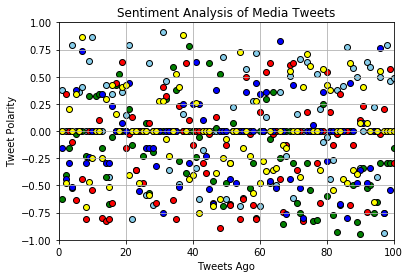
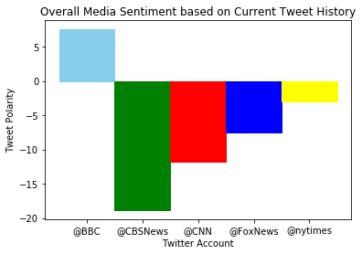

```python
# Dependencies
import numpy as np
import pandas as pd
import matplotlib.pyplot as plt
import json
import tweepy
import time
# Import and Initialize Sentiment Analyzer
from vaderSentiment.vaderSentiment import SentimentIntensityAnalyzer
analyzer = SentimentIntensityAnalyzer()
# Twitter API Keys
consumer_key = "############"
consumer_secret = "##########"
access_token = "################"
access_token_secret = "###############"
# Setup Tweepy API Authentication
auth = tweepy.OAuthHandler(consumer_key, consumer_secret)
auth.set_access_token(access_token, access_token_secret)
api = tweepy.API(auth, parser=tweepy.parsers.JSONParser())
```


```python
#Twitter accounts being pulled
source_accounts = ['@BBC', "@CBSNews" , "@CNN", "@FoxNews", '@nytimes']

# Array for holding the sentiment

sentiments = []
```


```python
for source in source_accounts:
    counter = 0   
    for x in range(1,6):
        public_tweets = api.user_timeline(source, page = x)
        
        for tweet in public_tweets:

            # Run Vader Analysis on each tweet
            compound = analyzer.polarity_scores(tweet["text"])["compound"]
            pos = analyzer.polarity_scores(tweet["text"])["pos"]
            neu = analyzer.polarity_scores(tweet["text"])["neu"]
            neg = analyzer.polarity_scores(tweet["text"])["neg"]
            counter = counter + 1

            # Add sentiments for each tweet into an array
            sentiments.append({"Date": tweet["created_at"], 
                           "Compound": compound,
                           "Positive": pos,
                           "Negative": neu,
                           "Neutral": neg,
                            'Source':source,
                              'tweets ago':counter}) 
```


```python
sentiments_pd = pd.DataFrame.from_dict(sentiments)
sentiments_pd
```


<div>
<style>
    .dataframe thead tr:only-child th {
        text-align: right;
    }

    .dataframe thead th {
        text-align: left;
    }

    .dataframe tbody tr th {
        vertical-align: top;
    }
</style>
<table border="1" class="dataframe">
  <thead>
    <tr style="text-align: right;">
      <th></th>
      <th>Compound</th>
      <th>Date</th>
      <th>Negative</th>
      <th>Neutral</th>
      <th>Positive</th>
      <th>Source</th>
      <th>tweets ago</th>
    </tr>
  </thead>
  <tbody>
    <tr>
      <th>0</th>
      <td>0.3818</td>
      <td>Fri Nov 03 17:31:05 +0000 2017</td>
      <td>0.843</td>
      <td>0.000</td>
      <td>0.157</td>
      <td>@BBC</td>
      <td>1</td>
    </tr>
    <tr>
      <th>1</th>
      <td>0.0000</td>
      <td>Fri Nov 03 17:03:04 +0000 2017</td>
      <td>1.000</td>
      <td>0.000</td>
      <td>0.000</td>
      <td>@BBC</td>
      <td>2</td>
    </tr>
    <tr>
      <th>2</th>
      <td>0.0000</td>
      <td>Fri Nov 03 17:01:02 +0000 2017</td>
      <td>1.000</td>
      <td>0.000</td>
      <td>0.000</td>
      <td>@BBC</td>
      <td>3</td>
    </tr>
    <tr>
      <th>3</th>
      <td>0.7906</td>
      <td>Fri Nov 03 16:32:04 +0000 2017</td>
      <td>0.708</td>
      <td>0.000</td>
      <td>0.292</td>
      <td>@BBC</td>
      <td>4</td>
    </tr>
    <tr>
      <th>4</th>
      <td>0.0000</td>
      <td>Fri Nov 03 16:01:05 +0000 2017</td>
      <td>1.000</td>
      <td>0.000</td>
      <td>0.000</td>
      <td>@BBC</td>
      <td>5</td>
    </tr>
    <tr>
      <th>5</th>
      <td>0.3612</td>
      <td>Fri Nov 03 15:25:06 +0000 2017</td>
      <td>0.839</td>
      <td>0.000</td>
      <td>0.161</td>
      <td>@BBC</td>
      <td>6</td>
    </tr>
    <tr>
      <th>6</th>
      <td>0.4019</td>
      <td>Fri Nov 03 15:09:46 +0000 2017</td>
      <td>0.863</td>
      <td>0.000</td>
      <td>0.137</td>
      <td>@BBC</td>
      <td>7</td>
    </tr>
    <tr>
      <th>7</th>
      <td>0.0000</td>
      <td>Fri Nov 03 14:05:17 +0000 2017</td>
      <td>1.000</td>
      <td>0.000</td>
      <td>0.000</td>
      <td>@BBC</td>
      <td>8</td>
    </tr>
    <tr>
      <th>8</th>
      <td>0.6439</td>
      <td>Fri Nov 03 14:04:55 +0000 2017</td>
      <td>0.653</td>
      <td>0.000</td>
      <td>0.347</td>
      <td>@BBC</td>
      <td>9</td>
    </tr>
    <tr>
      <th>9</th>
      <td>0.8658</td>
      <td>Fri Nov 03 14:04:50 +0000 2017</td>
      <td>0.662</td>
      <td>0.000</td>
      <td>0.338</td>
      <td>@BBC</td>
      <td>10</td>
    </tr>
    <tr>
      <th>10</th>
      <td>0.0000</td>
      <td>Fri Nov 03 14:04:46 +0000 2017</td>
      <td>1.000</td>
      <td>0.000</td>
      <td>0.000</td>
      <td>@BBC</td>
      <td>11</td>
    </tr>
    <tr>
      <th>11</th>
      <td>0.0000</td>
      <td>Fri Nov 03 14:04:10 +0000 2017</td>
      <td>1.000</td>
      <td>0.000</td>
      <td>0.000</td>
      <td>@BBC</td>
      <td>12</td>
    </tr>
    <tr>
      <th>12</th>
      <td>0.0000</td>
      <td>Fri Nov 03 13:33:03 +0000 2017</td>
      <td>1.000</td>
      <td>0.000</td>
      <td>0.000</td>
      <td>@BBC</td>
      <td>13</td>
    </tr>
    <tr>
      <th>13</th>
      <td>0.4215</td>
      <td>Fri Nov 03 13:03:09 +0000 2017</td>
      <td>0.865</td>
      <td>0.000</td>
      <td>0.135</td>
      <td>@BBC</td>
      <td>14</td>
    </tr>
    <tr>
      <th>14</th>
      <td>-0.4215</td>
      <td>Fri Nov 03 12:32:01 +0000 2017</td>
      <td>0.632</td>
      <td>0.236</td>
      <td>0.132</td>
      <td>@BBC</td>
      <td>15</td>
    </tr>
    <tr>
      <th>15</th>
      <td>0.3400</td>
      <td>Fri Nov 03 12:05:03 +0000 2017</td>
      <td>0.844</td>
      <td>0.000</td>
      <td>0.156</td>
      <td>@BBC</td>
      <td>16</td>
    </tr>
    <tr>
      <th>16</th>
      <td>0.0000</td>
      <td>Fri Nov 03 11:04:05 +0000 2017</td>
      <td>1.000</td>
      <td>0.000</td>
      <td>0.000</td>
      <td>@BBC</td>
      <td>17</td>
    </tr>
    <tr>
      <th>17</th>
      <td>0.0000</td>
      <td>Fri Nov 03 10:29:02 +0000 2017</td>
      <td>1.000</td>
      <td>0.000</td>
      <td>0.000</td>
      <td>@BBC</td>
      <td>18</td>
    </tr>
    <tr>
      <th>18</th>
      <td>0.3612</td>
      <td>Fri Nov 03 09:43:00 +0000 2017</td>
      <td>0.884</td>
      <td>0.000</td>
      <td>0.116</td>
      <td>@BBC</td>
      <td>19</td>
    </tr>
    <tr>
      <th>19</th>
      <td>0.1511</td>
      <td>Fri Nov 03 09:37:08 +0000 2017</td>
      <td>0.923</td>
      <td>0.000</td>
      <td>0.077</td>
      <td>@BBC</td>
      <td>20</td>
    </tr>
    <tr>
      <th>20</th>
      <td>0.7906</td>
      <td>Fri Nov 03 09:36:17 +0000 2017</td>
      <td>0.632</td>
      <td>0.000</td>
      <td>0.368</td>
      <td>@BBC</td>
      <td>21</td>
    </tr>
    <tr>
      <th>21</th>
      <td>-0.8126</td>
      <td>Fri Nov 03 09:35:04 +0000 2017</td>
      <td>0.730</td>
      <td>0.270</td>
      <td>0.000</td>
      <td>@BBC</td>
      <td>22</td>
    </tr>
    <tr>
      <th>22</th>
      <td>-0.3595</td>
      <td>Fri Nov 03 09:34:25 +0000 2017</td>
      <td>0.898</td>
      <td>0.102</td>
      <td>0.000</td>
      <td>@BBC</td>
      <td>23</td>
    </tr>
    <tr>
      <th>23</th>
      <td>0.0000</td>
      <td>Fri Nov 03 09:34:04 +0000 2017</td>
      <td>1.000</td>
      <td>0.000</td>
      <td>0.000</td>
      <td>@BBC</td>
      <td>24</td>
    </tr>
    <tr>
      <th>24</th>
      <td>0.0000</td>
      <td>Fri Nov 03 09:30:10 +0000 2017</td>
      <td>1.000</td>
      <td>0.000</td>
      <td>0.000</td>
      <td>@BBC</td>
      <td>25</td>
    </tr>
    <tr>
      <th>25</th>
      <td>-0.5848</td>
      <td>Fri Nov 03 08:59:03 +0000 2017</td>
      <td>0.841</td>
      <td>0.159</td>
      <td>0.000</td>
      <td>@BBC</td>
      <td>26</td>
    </tr>
    <tr>
      <th>26</th>
      <td>0.6249</td>
      <td>Fri Nov 03 08:40:05 +0000 2017</td>
      <td>0.646</td>
      <td>0.099</td>
      <td>0.255</td>
      <td>@BBC</td>
      <td>27</td>
    </tr>
    <tr>
      <th>27</th>
      <td>-0.6808</td>
      <td>Fri Nov 03 08:19:03 +0000 2017</td>
      <td>0.600</td>
      <td>0.292</td>
      <td>0.108</td>
      <td>@BBC</td>
      <td>28</td>
    </tr>
    <tr>
      <th>28</th>
      <td>0.0000</td>
      <td>Fri Nov 03 08:01:04 +0000 2017</td>
      <td>1.000</td>
      <td>0.000</td>
      <td>0.000</td>
      <td>@BBC</td>
      <td>29</td>
    </tr>
    <tr>
      <th>29</th>
      <td>0.0000</td>
      <td>Fri Nov 03 07:40:03 +0000 2017</td>
      <td>1.000</td>
      <td>0.000</td>
      <td>0.000</td>
      <td>@BBC</td>
      <td>30</td>
    </tr>
    <tr>
      <th>...</th>
      <td>...</td>
      <td>...</td>
      <td>...</td>
      <td>...</td>
      <td>...</td>
      <td>...</td>
      <td>...</td>
    </tr>
    <tr>
      <th>470</th>
      <td>0.0000</td>
      <td>Fri Nov 03 04:02:01 +0000 2017</td>
      <td>1.000</td>
      <td>0.000</td>
      <td>0.000</td>
      <td>@nytimes</td>
      <td>71</td>
    </tr>
    <tr>
      <th>471</th>
      <td>-0.4215</td>
      <td>Fri Nov 03 03:47:05 +0000 2017</td>
      <td>0.670</td>
      <td>0.228</td>
      <td>0.103</td>
      <td>@nytimes</td>
      <td>72</td>
    </tr>
    <tr>
      <th>472</th>
      <td>0.4019</td>
      <td>Fri Nov 03 03:32:09 +0000 2017</td>
      <td>0.769</td>
      <td>0.000</td>
      <td>0.231</td>
      <td>@nytimes</td>
      <td>73</td>
    </tr>
    <tr>
      <th>473</th>
      <td>0.7096</td>
      <td>Fri Nov 03 03:17:08 +0000 2017</td>
      <td>0.688</td>
      <td>0.000</td>
      <td>0.312</td>
      <td>@nytimes</td>
      <td>74</td>
    </tr>
    <tr>
      <th>474</th>
      <td>0.5994</td>
      <td>Fri Nov 03 03:02:08 +0000 2017</td>
      <td>0.754</td>
      <td>0.000</td>
      <td>0.246</td>
      <td>@nytimes</td>
      <td>75</td>
    </tr>
    <tr>
      <th>475</th>
      <td>0.0000</td>
      <td>Fri Nov 03 02:47:05 +0000 2017</td>
      <td>1.000</td>
      <td>0.000</td>
      <td>0.000</td>
      <td>@nytimes</td>
      <td>76</td>
    </tr>
    <tr>
      <th>476</th>
      <td>0.0000</td>
      <td>Fri Nov 03 02:32:03 +0000 2017</td>
      <td>1.000</td>
      <td>0.000</td>
      <td>0.000</td>
      <td>@nytimes</td>
      <td>77</td>
    </tr>
    <tr>
      <th>477</th>
      <td>-0.3612</td>
      <td>Fri Nov 03 02:17:04 +0000 2017</td>
      <td>0.872</td>
      <td>0.128</td>
      <td>0.000</td>
      <td>@nytimes</td>
      <td>78</td>
    </tr>
    <tr>
      <th>478</th>
      <td>0.5719</td>
      <td>Fri Nov 03 02:02:01 +0000 2017</td>
      <td>0.654</td>
      <td>0.000</td>
      <td>0.346</td>
      <td>@nytimes</td>
      <td>79</td>
    </tr>
    <tr>
      <th>479</th>
      <td>0.4215</td>
      <td>Fri Nov 03 01:48:43 +0000 2017</td>
      <td>0.859</td>
      <td>0.000</td>
      <td>0.141</td>
      <td>@nytimes</td>
      <td>80</td>
    </tr>
    <tr>
      <th>480</th>
      <td>0.3818</td>
      <td>Fri Nov 03 01:32:08 +0000 2017</td>
      <td>0.874</td>
      <td>0.000</td>
      <td>0.126</td>
      <td>@nytimes</td>
      <td>81</td>
    </tr>
    <tr>
      <th>481</th>
      <td>-0.5423</td>
      <td>Fri Nov 03 01:17:03 +0000 2017</td>
      <td>0.710</td>
      <td>0.290</td>
      <td>0.000</td>
      <td>@nytimes</td>
      <td>82</td>
    </tr>
    <tr>
      <th>482</th>
      <td>0.0000</td>
      <td>Fri Nov 03 01:02:08 +0000 2017</td>
      <td>1.000</td>
      <td>0.000</td>
      <td>0.000</td>
      <td>@nytimes</td>
      <td>83</td>
    </tr>
    <tr>
      <th>483</th>
      <td>0.0000</td>
      <td>Fri Nov 03 00:47:00 +0000 2017</td>
      <td>1.000</td>
      <td>0.000</td>
      <td>0.000</td>
      <td>@nytimes</td>
      <td>84</td>
    </tr>
    <tr>
      <th>484</th>
      <td>-0.4404</td>
      <td>Fri Nov 03 00:32:06 +0000 2017</td>
      <td>0.791</td>
      <td>0.209</td>
      <td>0.000</td>
      <td>@nytimes</td>
      <td>85</td>
    </tr>
    <tr>
      <th>485</th>
      <td>-0.4767</td>
      <td>Fri Nov 03 00:17:05 +0000 2017</td>
      <td>0.853</td>
      <td>0.147</td>
      <td>0.000</td>
      <td>@nytimes</td>
      <td>86</td>
    </tr>
    <tr>
      <th>486</th>
      <td>0.6249</td>
      <td>Fri Nov 03 00:02:03 +0000 2017</td>
      <td>0.806</td>
      <td>0.000</td>
      <td>0.194</td>
      <td>@nytimes</td>
      <td>87</td>
    </tr>
    <tr>
      <th>487</th>
      <td>-0.3612</td>
      <td>Thu Nov 02 23:47:03 +0000 2017</td>
      <td>0.872</td>
      <td>0.128</td>
      <td>0.000</td>
      <td>@nytimes</td>
      <td>88</td>
    </tr>
    <tr>
      <th>488</th>
      <td>-0.3950</td>
      <td>Thu Nov 02 23:32:06 +0000 2017</td>
      <td>0.830</td>
      <td>0.170</td>
      <td>0.000</td>
      <td>@nytimes</td>
      <td>89</td>
    </tr>
    <tr>
      <th>489</th>
      <td>0.0772</td>
      <td>Thu Nov 02 23:17:06 +0000 2017</td>
      <td>0.843</td>
      <td>0.000</td>
      <td>0.157</td>
      <td>@nytimes</td>
      <td>90</td>
    </tr>
    <tr>
      <th>490</th>
      <td>0.4019</td>
      <td>Thu Nov 02 23:17:05 +0000 2017</td>
      <td>0.495</td>
      <td>0.211</td>
      <td>0.294</td>
      <td>@nytimes</td>
      <td>91</td>
    </tr>
    <tr>
      <th>491</th>
      <td>0.0772</td>
      <td>Thu Nov 02 23:02:06 +0000 2017</td>
      <td>0.915</td>
      <td>0.000</td>
      <td>0.085</td>
      <td>@nytimes</td>
      <td>92</td>
    </tr>
    <tr>
      <th>492</th>
      <td>0.0000</td>
      <td>Thu Nov 02 22:47:01 +0000 2017</td>
      <td>1.000</td>
      <td>0.000</td>
      <td>0.000</td>
      <td>@nytimes</td>
      <td>93</td>
    </tr>
    <tr>
      <th>493</th>
      <td>-0.6486</td>
      <td>Thu Nov 02 22:32:04 +0000 2017</td>
      <td>0.765</td>
      <td>0.235</td>
      <td>0.000</td>
      <td>@nytimes</td>
      <td>94</td>
    </tr>
    <tr>
      <th>494</th>
      <td>0.0000</td>
      <td>Thu Nov 02 22:16:01 +0000 2017</td>
      <td>1.000</td>
      <td>0.000</td>
      <td>0.000</td>
      <td>@nytimes</td>
      <td>95</td>
    </tr>
    <tr>
      <th>495</th>
      <td>0.5563</td>
      <td>Thu Nov 02 22:00:22 +0000 2017</td>
      <td>0.770</td>
      <td>0.000</td>
      <td>0.230</td>
      <td>@nytimes</td>
      <td>96</td>
    </tr>
    <tr>
      <th>496</th>
      <td>0.0000</td>
      <td>Thu Nov 02 21:45:05 +0000 2017</td>
      <td>1.000</td>
      <td>0.000</td>
      <td>0.000</td>
      <td>@nytimes</td>
      <td>97</td>
    </tr>
    <tr>
      <th>497</th>
      <td>0.0000</td>
      <td>Thu Nov 02 21:41:02 +0000 2017</td>
      <td>1.000</td>
      <td>0.000</td>
      <td>0.000</td>
      <td>@nytimes</td>
      <td>98</td>
    </tr>
    <tr>
      <th>498</th>
      <td>0.0000</td>
      <td>Thu Nov 02 21:30:20 +0000 2017</td>
      <td>1.000</td>
      <td>0.000</td>
      <td>0.000</td>
      <td>@nytimes</td>
      <td>99</td>
    </tr>
    <tr>
      <th>499</th>
      <td>0.0000</td>
      <td>Thu Nov 02 21:21:04 +0000 2017</td>
      <td>1.000</td>
      <td>0.000</td>
      <td>0.000</td>
      <td>@nytimes</td>
      <td>100</td>
    </tr>
  </tbody>
</table>
<p>500 rows × 7 columns</p>
</div>


```python
BBC_Plot = sentiments_pd[sentiments_pd['Source']=='@BBC']
CBS_Plot = sentiments_pd[sentiments_pd['Source']=='@CBSNews']
CNN_Plot = sentiments_pd[sentiments_pd['Source']=='@CNN']
Fox_Plot = sentiments_pd[sentiments_pd['Source']=='@FoxNews']
NYT_Plot = sentiments_pd[sentiments_pd['Source']=='@nytimes']
```


```python
plt.scatter( x = BBC_Plot['tweets ago'] , y = BBC_Plot['Compound'], c = 'skyblue',linewidth = 1,edgecolor = 'black')
plt.scatter( x = CBS_Plot['tweets ago'] , y = CBS_Plot['Compound'], c = 'green',linewidth = 1,edgecolor = 'black')
plt.scatter( x = CNN_Plot['tweets ago'] , y = CNN_Plot['Compound'], c = 'red',linewidth = 1,edgecolor = 'black')
plt.scatter( x = Fox_Plot['tweets ago'] , y = Fox_Plot['Compound'], c = 'blue',linewidth = 1,edgecolor = 'black')
plt.scatter( x = NYT_Plot['tweets ago'] , y = NYT_Plot['Compound'], c = 'yellow',linewidth = 1,edgecolor = 'black')
plt.title("Sentiment Analysis of Media Tweets")
plt.ylabel("Tweet Polarity")
plt.xlabel("Tweets Ago")

plt.xlim([0, 100])
plt.ylim([-1, 1])
plt.grid(True)
plt.show()
```





```python
Overall = sentiments_pd.groupby('Source').sum()
Overall = Overall.reset_index(drop = True)
index = Overall.index
polarity = Overall.Compound
bar_width = 1
Overall
```


<div>
<style>
    .dataframe thead tr:only-child th {
        text-align: right;
    }

    .dataframe thead th {
        text-align: left;
    }

    .dataframe tbody tr th {
        vertical-align: top;
    }
</style>
<table border="1" class="dataframe">
  <thead>
    <tr style="text-align: right;">
      <th></th>
      <th>Compound</th>
      <th>Negative</th>
      <th>Neutral</th>
      <th>Positive</th>
      <th>tweets ago</th>
    </tr>
  </thead>
  <tbody>
    <tr>
      <th>0</th>
      <td>7.5158</td>
      <td>85.613</td>
      <td>5.440</td>
      <td>8.946</td>
      <td>5050</td>
    </tr>
    <tr>
      <th>1</th>
      <td>-18.8441</td>
      <td>81.958</td>
      <td>13.831</td>
      <td>4.211</td>
      <td>5050</td>
    </tr>
    <tr>
      <th>2</th>
      <td>-11.8172</td>
      <td>84.993</td>
      <td>10.435</td>
      <td>4.571</td>
      <td>5050</td>
    </tr>
    <tr>
      <th>3</th>
      <td>-7.4642</td>
      <td>85.966</td>
      <td>8.728</td>
      <td>5.306</td>
      <td>5050</td>
    </tr>
    <tr>
      <th>4</th>
      <td>-2.9273</td>
      <td>84.811</td>
      <td>7.861</td>
      <td>7.328</td>
      <td>5050</td>
    </tr>
  </tbody>
</table>
</div>


```python
bar = plt.bar(index ,polarity, bar_width, edgecolor = 'black')
bar[0].set_color('skyblue')
bar[1].set_color('green')
bar[2].set_color('red')
bar[3].set_color('blue')
bar[4].set_color('yellow')
plt.xlabel('Twitter Account')
plt.ylabel('Tweet Polarity')
plt.title('Overall Media Sentiment based on Current Tweet History')
plt.xticks(index,source_accounts)
plt.show()
```




